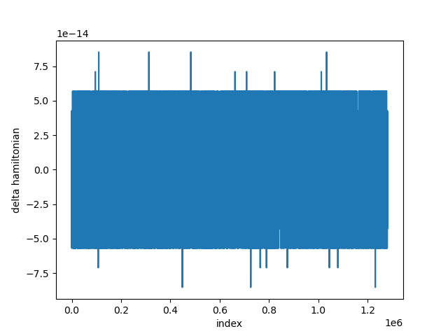
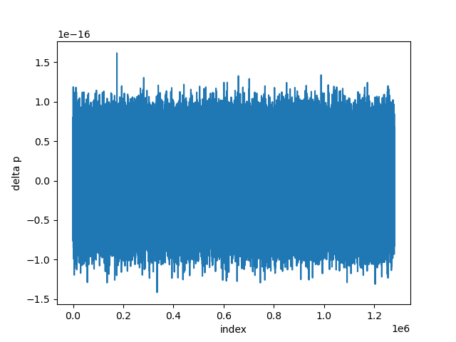
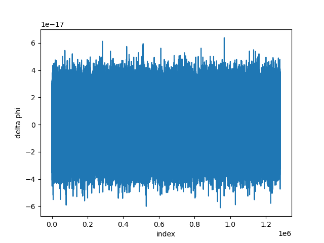
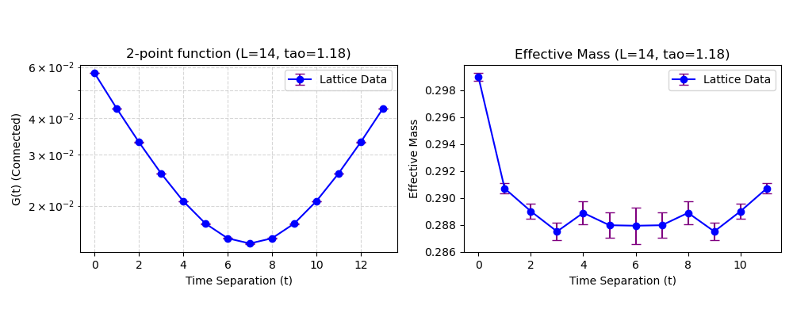

# Report on the 2-dim lattice $\phi^{4}$ simulations with HMC algorithm (Double precision)

**Date:** January 27, 2026
**Based on:** Ref [1] and HMC_final output

## Contents

1. HMC Hamiltonian
2. Molecular dynamics evolution equation used in HMC
3. MD integrator
4. Numerical results

---

## 1. HMC Hamiltonian

The HMC Hamiltonian is defined by

$$
H(p,\phi)=\sum_{n}\frac{1}{2}p(n)^{2}+S(\phi), \quad (1.1)
$$

$$
S(\phi)=\sum_{n}\phi(n)[\sum_{\mu=1}^{2}(-\phi(n+\hat{\mu})+2\phi(n)-\phi(n-\hat{\mu}))+m^{2}\phi(n)+\lambda\phi(n)^{3}], \quad (1.2)
$$

where $p(n)$ and $\phi(n)$ are real valued 2-dimensional arrays (lattice fields). We impose periodic boundary condition on $\phi(n)$.

---

## 2. Molecular dynamics evolution equation used in HMC

The momentum $p(n)$ is defined by $\dot{\phi}(n)=p(n)$ for the Hamilton's EoM, where $\dot{} \equiv\frac{d}{d\tau}$ is the derivative with respect to the fictitious time $\tau$.

The conservation of energy, $\dot{H}=0$, yields the EoM for $p(n)$ as follows.

$$
\dot{p}(n)=-2[\sum_{\mu=1}^{2}(-\phi(n+\hat{\mu})+2\phi(n)-\phi(n-\hat{\mu}))]-2m^{2}\phi(n)-4\lambda\phi(n)^{3}. \quad (2.3)
$$

---

## 3. MD integrator

I used the leapfrog integrator, where $p(n)$ is updated first.

---

## 4. Numerical results

The simulation parameters are identical to the reference:
$$
N_{t}=N_{x}=14, \quad m^{2}=-4, \quad \lambda=5.113.
$$

* The trajectory length is $\tau=1.18$, and the MD steps for one trajectory is $N_{MD}=10$.
* **Current Work Statistics:**
    * Total Samples: 1,280,000 (Ensemble shape: `[1280000, 14, 14]`).
    * Thermalization: 3,000 steps (discarded).
    * Bin size for analysis: 100.
    * Bootstrap samples: 2,000.

### 4.1 MD reversibility, HMC statistics, and area preservation

The leapfrog MD integrator should be time reversible. Figure 1 shows the trajectory history of the metrics $\Delta H$, $\Delta p$, and $\Delta \phi$ for the current simulation run.

**Figure 1: Reversibility checks (Current Work)**

The HMC statistics are shown in Table 1, comparing the Reference values (Ref [1]) with the Current Work.

**Table 1: HMC statistics**

| Quantity | Reference Value (Ref [1]) | Current Work |
| :--- | :--- | :--- |
| $\langle dH \rangle$ | $0.29230(24)$ | **$0.29273(68)$** |
| $\langle \exp[-dH] \rangle$ | $1.00010(27)$ | **$1.00000(82)$** |
| Acceptance Rate | $0.70395(17)$ | **$0.70416(13)$** |

$\langle \exp[-dH]\rangle=1$, which is a required condition for the area preservation of the MD integrator, holds within error margins in the current work.

### 4.2 Moments

I measured moments $\mu_{p}$ defined by
$$
\mu_{p}\equiv\frac{1}{N_{t}N_{x}}\sum_{n}\langle\phi(n)^{p}\rangle, \quad (4.4)
$$
for $p=1,2,3,4,5$. The results are shown in Table 2.

**Table 2: Moments of $\phi(n)$**

| $p$ | Reference Value (Ref [1]) | Current Work |
| :--- | :--- | :--- |
| 1 | $2.1(3.4) \times 10^{-4}$ | **$1.75(2.94) \times 10^{-4}$** |
| 2 | $0.218395(23)$ | **$0.218413(20)$** |
| 3 | $0.9(1.4) \times 10^{-4}$ | **$0.72(1.21) \times 10^{-4}$** |
| 4 | $0.090676(15)$ | **$0.090677(13)$** |
| 5 | N/A | **$0.39(0.61) \times 10^{-4}$** |

Odd order moments are consistent with zero as expected.

### 4.3 Two-point function and effective mass

The two-point function and effective mass are defined by
$$
G_{c}(n)\equiv\frac{1}{N_{x}N_{t}}\sum_{m}[\langle\phi(m)\phi(m+n)\rangle-\langle\phi(m)\rangle\langle\phi(m+n)\rangle], \quad (4.5)
$$
$$
\tilde{G}_{c}(n_{t})=\frac{1}{N_{x}}\sum_{n_{x}}G_{c}(n_{t},n_{x}), \quad (4.6)
$$
$$
m_{eff}(n_{t})=\cosh^{-1}[(\tilde{G}_{c}(n_{t}-1)+\tilde{G}_{c}(n_{t}+1))/(2\tilde{G}_{c}(n_{t}))] \quad (4.7)
$$

[cite_start]Table 3 shows the numerical values of the two-point function, comparing the reference data with the current high-precision results[cite: 102].

**Table 3: Two-point function data ($n_{t}, \tilde{G}_{c}(n_{t})$)**

| $n_t$ | Reference $\tilde{G}_{c}(n_{t})$ (Ref [1]) | Reference Error | Current $\tilde{G}_{c}(n_{t})$ | Current Error |
| :--- | :--- | :--- | :--- | :--- |
| 0 | 5.709419332566849E-02 | 3.902874113342521E-05 | **5.7136915209222344E-02** | **3.4721695942019510E-05** |
| 1 | 4.312005288581634E-02 | 3.984353031557276E-05 | **4.3167729633984957E-02** | **3.5694974878851345E-05** |
| 2 | 3.302722987341092E-02 | 4.115498129929297E-05 | **3.3086229564185311E-02** | **3.6925543649421497E-05** |
| 3 | 2.575495720813648E-02 | 4.308962088618342E-05 | **2.5820770064277593E-02** | **3.8785617686206493E-05** |
| 4 | 2.065097431166036E-02 | 4.547417831670588E-05 | **2.0727227247338994E-02** | **4.0960297014504484E-05** |
| 5 | 1.727882957996651E-02 | 4.800169306581628E-05 | **1.7358982939126494E-02** | **4.3460091042681661E-05** |
| 6 | 1.536547103896309E-02 | 5.015599738425134E-05 | **1.5449700525493605E-02** | **4.5790319801342316E-05** |
| 7 | 1.473909729413228E-02 | 5.129375836383202E-05 | **1.4830610199911368E-02** | **4.6950298772613152E-05** |
| 8 | 1.536547103896309E-02 | 5.015599738424737E-05 | **1.5449700525493605E-02** | **4.5790319801342282E-05** |
| 9 | 1.727882957996651E-02 | 4.800169306581216E-05 | **1.7358982939126494E-02** | **4.3460091042681648E-05** |
| 10 | 2.065097431166036E-02 | 4.547417831670241E-05 | **2.0727227247338994E-02** | **4.0960297014504504E-05** |
| 11 | 2.575495720813648E-02 | 4.308962088617478E-05 | **2.5820770064277593E-02** | **3.8785617686206507E-05** |
| 12 | 3.302722987341091E-02 | 4.115498129928508E-05 | **3.3086229564185311E-02** | **3.6925543649421613E-05** |
| 13 | 4.312005288581634E-02 | 3.984353031556026E-05 | **4.3167729633984957E-02** | **3.5694974878851372E-05** |

Figure 2 shows the two-point function and effective mass from the current simulation.

**Figure 2: Two-point function and effective mass (Current Work)**

### References
[1] M. S. Albergo, G. Kanwar and P. E. Shanahan, "Flow-based generative models for Markov chain Monte Carlo in lattice field theory," Phys. Rev. D 100 (2019) no.3, 034515.