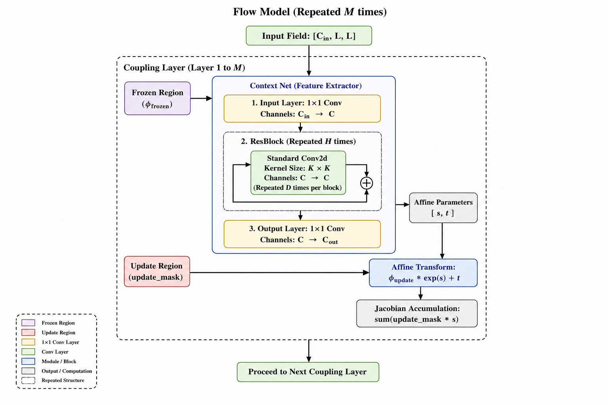
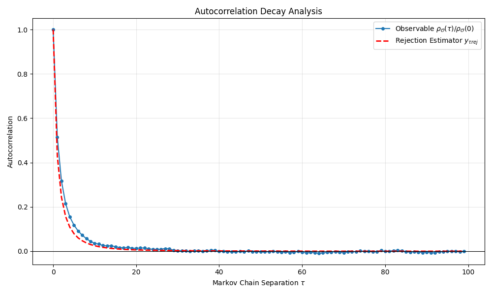

# FLOPs Analysis And Autocorrelation Time

## 1. Architecture Overview

This network is a Normalizing Flow model designed for scalar field configuration generation. It utilizes purely local convolutional operations to achieve UV-IR decoupling. 

A single forward mapping step consists of $M$ stacked **Coupling Layers**. Each Coupling Layer partitions the spatial lattice into two regions using a checkerboard mask. It freezes one half of the physical field ($\phi_{\text{frozen}}$) and passes it through a **Context Network** (a feature extractor). The Context Network is a deep convolutional architecture built from standard Residual Blocks (ResBlocks). It outputs the affine transformation parameters (scale $s$ and translation $t$) which are then used to update the unmasked half of the field.

------

## 2. Abstract FLOPs Calculation Formula

To calculate the Floating Point Operations (FLOPs), we define the following variables corresponding to the architecture:

- $L$: **Lattice Size**. Spatial resolution of the field ($L \times L$).
- $C_{\text{in}}$: **Input Channels**. Number of physical field channels.
- $C_{\text{out}}$: **Output Channels**. Number of affine parameter channels.
- $M$: **Coupling Layers**. Total number of sequential Coupling Layers.
- $C$: **Hidden Channels**. Internal channel width used throughout the Context Net.
- $H$: **Hidden Layers**. Number of sequential ResBlocks inside a Context Net.
- $K$: **Kernel Size**. Spatial dimension of the convolutional filter.
- $D$: **Block Depth**. Number of consecutive convolutional layers inside a single ResBlock.
- $B$: **Batch Size**. Number of independent samples processed simultaneously.
- $F_{\text{elem}}$: **Element-wise FLOPs**. The exact number of floating-point operations required per spatial element for the affine transformation and Jacobian accumulation.

A standard Multiply-Accumulate (MAC) operation equates to **2 FLOPs** (1 multiplication + 1 addition). For a 2D convolution ($X$ input channels, $Y$ output channels, $K \times K$ kernel, $L \times L$ grid), the cost is $2 \cdot X \cdot Y \cdot K^2 \cdot L^2$.

### 2.1. Context Network ($FLOPs_{\text{net}}$)

**Base Formula for 2D Convolution FLOPs**

A single Multiply-Accumulate (MAC) operation counts as 2 FLOPs (one multiplication, one addition). For any standard 2D convolution with $X$ input channels, $Y$ output channels, a spatial resolution of $L \times L$, and a kernel size of $K \times K$, the theoretical FLOPs calculation is:

$$\text{FLOPs} = 2 \cdot X \cdot Y \cdot K^2 \cdot L^2$$

------

#### Step 1: Input Layer ($1 \times 1$ Conv)

The first block in the Context Net, it takes the input field ($C_{\text{in}}$ channels) and maps it to the hidden dimension ($C$ channels) using a $1 \times 1$ kernel.

- **Channels:** $C_{\text{in}} \rightarrow C$

- **Kernel Area:** $1^2$

  $$\text{FLOPs}_{\text{in}} = 2 \cdot C_{\text{in}} \cdot C \cdot 1^2 \cdot L^2 = 2 \cdot C_{\text{in}} \cdot C \cdot L^2$$

#### Step 2: Hidden Layers (ResBlocks)

This section requires breaking down the nested repetitions shown in the diagram.

- **2a. Single Standard Conv2d:**

  Inside the ResBlock, a standard convolution maintains the hidden channel dimension ($C \rightarrow C$) using a $K \times K$ kernel.

  $$\text{FLOPs}_{\text{conv}} = 2 \cdot C \cdot C \cdot K^2 \cdot L^2 = 2 \cdot C^2 \cdot K^2 \cdot L^2$$

- **2b. Single ResBlock:**

  The diagram notes that this standard Conv2d is "Repeated $D$ times per block". *(Note: The element-wise residual addition $\oplus$ is omitted from this formula as its FLOP cost is infinitesimally small compared to matrix convolutions).*

  $$\text{FLOPs}_{\text{block}} = D \cdot (2 \cdot C^2 \cdot K^2 \cdot L^2)$$

- **2c. All ResBlocks:**

  The entire ResBlock structure is "Repeated $H$ times".

  $$\text{FLOPs}_{\text{hidden}} = H \cdot \text{FLOPs}_{\text{block}} = H \cdot D \cdot 2 \cdot C^2 \cdot K^2 \cdot L^2$$

#### Step 3: Output Layer ($1 \times 1$ Conv)

The final block in the Context Net reduces the hidden dimension ($C$ channels) to the required affine parameters ($C_{\text{out}}$ channels) using a $1 \times 1$ kernel.

- **Channels:** $C \rightarrow C_{\text{out}}$

- **Kernel Area:** $1^2$

  $$\text{FLOPs}_{\text{out}} = 2 \cdot C \cdot C_{\text{out}} \cdot 1^2 \cdot L^2 = 2 \cdot C \cdot C_{\text{out}} \cdot L^2$$

------

#### Step 4: Total Context Net Aggregation

To get the total computational cost of the Context Network, we sum the FLOPs from the three sequential stages:

$$\text{FLOPs}_{\text{net}} = \text{FLOPs}_{\text{in}} + \text{FLOPs}_{\text{hidden}} + \text{FLOPs}_{\text{out}}$$

$$\text{FLOPs}_{\text{net}} = (2 \cdot C_{\text{in}} \cdot C \cdot L^2) + (H \cdot D \cdot 2 \cdot C^2 \cdot K^2 \cdot L^2) + (2 \cdot C \cdot C_{\text{out}} \cdot L^2)$$

#### Step 5: Factoring the Equation

To arrive at target formula, we factor out the common mathematical terms shared across all three stages, which are $2 \cdot L^2 \cdot C$:

- From the Input Layer, we are left with: $C_{\text{in}}$
- From the Hidden Layers, we are left with: $H \cdot D \cdot C \cdot K^2$
- From the Output Layer, we are left with: $C_{\text{out}}$

Extracting these yields the final, simplified formula:

$$\text{FLOPs}_{\text{net}} = 2 \cdot L^2 \cdot C \cdot \left( C_{\text{in}} + C_{\text{out}} + H \cdot D \cdot C \cdot K^2 \right)$$

### 2.2. Affine & Jacobian Operations ($FLOPs_{\text{affine}}$)

The element-wise mathematical functions applied to the unmasked grid:

$$FLOPs_{\text{affine}} = F_{\text{elem}} \cdot C_{\text{in}} \cdot L^2$$

### 2.3. Total FLOPs Formulas

For a **single sample** passing through all $M$ layers:

$$FLOPs_{\text{sample}} = M \cdot \left( FLOPs_{\text{net}} + FLOPs_{\text{affine}} \right)$$

For a **complete forward pass** with a batch size of $B$:

$$FLOPs_{\text{forward}} = B \cdot FLOPs_{\text{sample}}$$

------

## 3. Concrete FLOPs Calculation (Based on CONFIG)

We now apply the specific parameters from the provided configuration to calculate the exact theoretical FLOPs for one forward pass.

### 3.1. Parameter Mapping

Based on the `CONFIG` dictionary and scalar field theory:

- $L = 14$
- $M = 12$ (`cnn_coupling_layers`)
- $C_{\text{in}} = 1$ (Standard scalar field)
- $C_{\text{out}} = 2$ (Affine parameters $s$ and $t$)
- $C = 256$ (`hidden_channels`)
- $H = 4$ (`hidden_layers`)
- $K = 3$ (`kernel_size`)
- $D = 3$ (`branch_depth`)
- $B = 1$ (`batch_size`)

### 3.2. Deriving the Element-wise Constant ($F_{\text{elem}}$)

**1. Affine Transformation (Field Update):**

$$\phi'(x) = \phi_{\text{frozen}}(x) + m_u(x) \cdot \left[ \phi(x) \cdot \exp(s(x)) + t(x) \right]$$

**2. Jacobian Accumulation (Log-Determinant):**

$$\log \det \left| \frac{\partial \phi'}{\partial \phi} \right| = \sum_{x} m_u(x) \cdot s(x)$$

For the unmasked spatial grid, the explicit operations per element are:

1. `exp(s)` $\rightarrow$ 1 FLOP
2. `phi * exp(s)` $\rightarrow$ 1 FLOP
3. `... + t` $\rightarrow$ 1 FLOP
4. `update_mask * (...)` $\rightarrow$ 1 FLOP
5. `phi_frozen + phi_updated` $\rightarrow$ 1 FLOP
6. `update_mask * s` $\rightarrow$ 1 FLOP
7. `sum(...)` $\rightarrow$ 1 FLOP (amortized addition across the grid)

Total exact element-wise FLOPs: **$F_{\text{elem}} = 7$**.

### 3.3. Step-by-Step Evaluation

**Step A: Core Convolutional Arithmetic ($H \cdot D \cdot C \cdot K^2$)**

$$4 \cdot 3 \cdot 256 \cdot 3^2 = 12 \cdot 256 \cdot 9 = 27648$$

**Step B: Single Context Network ($FLOPs_{\text{net}}$)**

Summing the channels: $C_{\text{in}} + C_{\text{out}} + 27,648 = 1 + 2 + 27,648 = 27,651$

Multiplier: $2 \cdot L^2 \cdot C = 2 \cdot 14^2 \cdot 256 = 2 \cdot 196 \cdot 256 = 100,352$

$$FLOPs_{\text{net}} = 100,352 \cdot 27,651 = 2,774,833,152 \text{ FLOPs}$$

**Step C: Single Affine & Jacobian Update ($FLOPs_{\text{affine}}$)**

$$FLOPs_{\text{affine}} = 7 \cdot 1 \cdot 14^2 = 7 \cdot 196 = 1,372 \text{ FLOPs}$$

**Step D: Complete Single Sample ($FLOPs_{\text{sample}}$)**

Calculations for one Coupling Layer:

$$2,744,833,152 + 1,372 = 2,774,834,524 \text{ FLOPs}$$

Total for all $M=12$ Layers:

$$FLOPs_{\text{sample}} = 12 \cdot 2,774,834,524 = 33,298,014,288 \text{ FLOPs}$$

**Step E: Total Forward Pass ($FLOPs_{\text{forward}}$)**

Factoring in the batch size ($B = 1$):

$$FLOPs_{\text{forward}} = 1 \cdot 33,298,014,288$$

$$FLOPs_{\text{forward}} = 33,298,014,288 \text{ FLOPs}$$

### 4.Analysis results using ptflops

Computational complexity:       16.68 GMac
Number of parameters:           85.06 M 
Total FLOPs (1 MAC ≈ 2 FLOPs): 33.36 GFLOPs

### 5.Autocorrelation Time

The integral autocorrelation time ($\tau_{int} $ of the physical quantity is approximately 2.1533. 

The integral autocorrelation time prediction based on the MH rejection rate is 1.6944.

