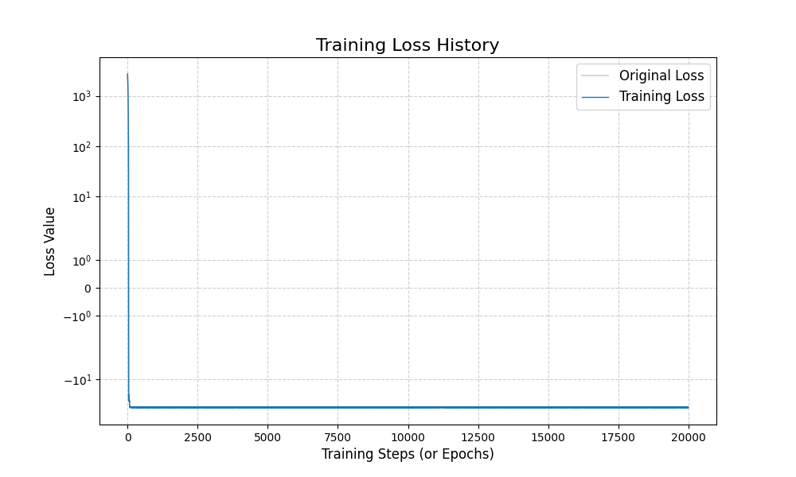
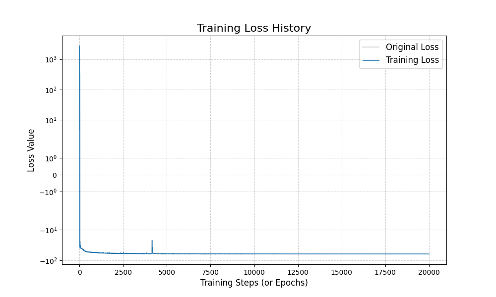

# Report: Comparative Analysis of CNN vs. ResNet Architectures in Flow-based Lattice MCMC

## 1. Principles and Workflow of Residual Connections (ResNet)
To improve the expressiveness of the Flow-based model, we introduced **Residual Connections** into the context networks. This architectural choice is designed to overcome the limitations of standard deep convolutional stacks.

### 1.1 The Residual Learning Principle
In a standard CNN, each layer must learn a complete transformation $H(x)$. As the network becomes deeper, it becomes harder for the model to maintain the identity mapping, which is crucial for Normalizing Flows to remain stable at the start of training.

Residual learning changes the objective. Instead of $H(x)$, the layer learns the **Residual Function** $F(x) := H(x) - x$. The block then adds the original input back to the result:
$$y = F(x) + x$$
This "shortcut" allows gradients to flow unimpeded through the identity path, preventing the vanishing gradient problem and allowing for much deeper architectures.

### 1.2 Operational Flow in the ResBlock
Based on the implementation in `cnn_res_net.py`, each block follows this logic:
1. **Input ($x$):** The field configuration or feature map from the previous layer.
2. **Residual Path:** Two 3x3 convolutions with circular padding and LeakyReLU activations.
3. **Skip Connection:** The input $x$ is added directly to the output of the convolutions.
4. **Result:** This ensures that if the weights are small, the layer defaults to an identity mapping, which is physically safer for initialization.

## 2. Code Architecture Analysis
The generative process is built on a hierarchical structure: `ConvContextNet` → `FlowModel` → `MH Sampling`.

### 2.1 Context Network (`ConvContextNet`)
This module performs the non-linear feature extraction.
* **Dimensionality Expansion:** The 1-channel physical field is first expanded to `hidden_channels` (e.g., 16) via an initial convolution.
* **Residual Stack:** 6 `ResBlocks` process the features, allowing the model to capture long-range correlations on the $14 \times 14$ lattice.
* **Output Projection:** A final convolution reduces the channels back to 2 (one for $s$ and one for $t$).
* **Zero-Init Strategy:** The final layer is initialized to zero. This ensures the flow starts as an identity transform ($\exp(0)=1, t=0$), which is a critical "warm-up" state for lattice simulations.
### 2.2 Training Loss Comparison
The following figures illustrate the training history for both architectures over 20,000 iterations at $L=14$.

#### 2.2.1 Standard CNN Loss

* **Observations:** The convergence is extremely smooth. After the initial drop from $10^3$, the loss stabilizes around $-15$ without any visible noise. This indicates a very stable, albeit potentially less flexible, optimization path.

#### 2.2.2 ResNet Loss

* **Observations:** While the final loss value is lower (reaching approximately $-17.5$), the path is more volatile. A significant **gradient spike** occurs near iteration 4,000. This spike suggests that the ResNet is exploring a more complex region of the parameter space, eventually finding a deeper local minimum than the plain CNN.

## 3. Performance and Acceptance Rates
The primary metric for the quality of the generative model is the **Metropolis-Hastings Acceptance Rate**. A higher rate indicates that the model's generated distribution $q(\phi)$ is closer to the true physical distribution $p(\phi)$.

| Metric | Plain CNN (`cnn_flow.py`) | ResNet (`cnn_res_net.py`) |
| :--- | :--- | :--- |
| **Final Training Loss** | ~ -36 | ~ -61 |
| **Acceptance Rate** | **~ 15%** | **~ 45%** |

