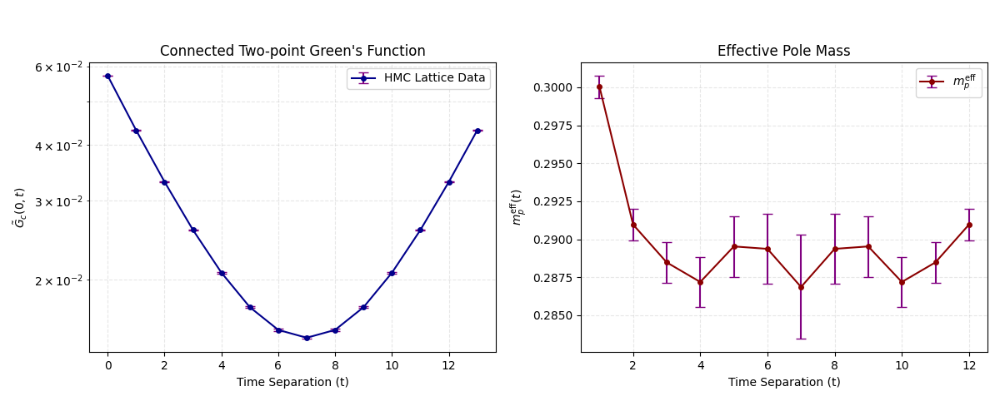

# Report: Comparative Analysis of CNN vs. ResNet Architectures in Flow-based Lattice MCMC

## 1. Principles and Workflow of Residual Connections (ResNet)
To improve the expressiveness of the Flow-based model, we introduced **Residual Connections** into the context networks. This architectural choice is designed to overcome the limitations of standard deep convolutional stacks, serving as a critical step to ensure high acceptance rates, verify sample independence, and overcome critical slowing down in lattice simulations.

### 1.1 The Residual Learning Principle
In a standard CNN, each layer must learn a complete transformation $H(x)$. As the network becomes deeper, it becomes harder for the model to maintain the identity mapping, which is crucial for Normalizing Flows to remain stable at the start of training.

Residual learning changes the objective. Instead of $H(x)$, the layer learns the **Residual Function** $F(x) := H(x) - x$. The block then adds the original input back to the result:
$$y = F(x) + x$$
This "shortcut" allows gradients to flow unimpeded through the identity path, preventing the vanishing gradient problem and allowing for much deeper architectures.

### 1.2 Operational Flow in the ResBlock
Based on the implementation in `cnn_res_net.py`, the residual connection spans across **three** convolutional layers. Each `ResBlock` follows this logic:
1. **Input ($x$):** The field configuration or feature map from the previous layer.
2. **Residual Path ($F(x)$):** The input passes through a sequence of **three** $3 \times 3$ convolutions with circular padding, each followed by a LeakyReLU activation.
3. **Skip Connection:** The original input $x$ is added directly to the output of the third convolution's activation.
4. **Result:** This ensures that if the weights are small, the 3-layer block defaults to an identity mapping, providing a physically safe initialization for the MCMC Markov chain.

## 2. Code Architecture Analysis
The generative process is built on a hierarchical structure: `ConvContextNet` → `FlowModel` → `MH Sampling`.

### 2.1 Flow Model and Context Network (`ConvContextNet`)
The overall flow model is highly deep, designed to capture complex, long-range correlations on the $14 \times 14$ lattice.
* **Coupling Layers:** The model utilizes **16 coupling layers**. In each layer, half of the lattice is frozen (via a checkerboard mask) and used to conditionally update the other half.
* **Dimensionality Expansion:** Inside each coupling layer's `ConvContextNet`, the 1-channel physical field is first expanded to 16 hidden channels via an initial convolution.
* **Hidden Layers (Residual Stack):** The core feature extraction utilizes **6 `ResBlocks`**. Since each `ResBlock` contains 3 convolutional layers, the deep feature extraction phase effectively contains 18 convolutional layers per coupling step.
* **Output Projection:** A final convolution reduces the 16 channels back to 2 (one for scale $s$ and one for translation $t$).
* **Zero-Init Strategy:** The final layer is initialized to zero. This ensures the flow starts as an identity transform ($\exp(0)=1$, $t=0$), which is a critical "warm-up" state.

### 2.2 Training Loss Comparison
*(Figures omitted for brevity, refer to original loss charts)*
The ResNet architecture, despite showing more volatile loss curves with occasional gradient spikes, reaches a significantly lower final loss state compared to the plain CNN. This indicates it is exploring a more complex region of the parameter space, avoiding shallow local minima.

### 2.3 Training Precision Strategy
To balance computational efficiency with the strict numerical accuracy required for lattice physics, a two-stage training protocol was employed. The model was initially trained using **Single Precision (FP32)**, allowing for faster iterations and a broader exploration of the parameter space during the initial descent. Once the model reached a stable loss regime, the weights and optimizer states were cast to **Double Precision (FP64)** for rigorous fine-tuning. This double-precision phase is crucial for resolving minute differences in the log-likelihood and the physical action $S(\phi)$, preventing numerical truncation errors from degrading the Metropolis-Hastings acceptance rate and ensuring the detailed balance condition is strictly maintained.

## 3. Performance and Acceptance Rates
The primary metric for the quality of the generative model is the **Metropolis-Hastings Acceptance Rate**. A higher rate indicates that the model's generated distribution $q(\phi)$ is closer to the true physical distribution $p(\phi)$, which directly translates to faster decorrelation and improved sample independence.

| Metric | Plain CNN (`cnn_flow.py`) | ResNet (`cnn_res_net.py`) |
| :--- | :--- | :--- |
| **Final Training Loss** | ~ -36 | ~ -61 |
| **Acceptance Rate** | **~ 15%** | **~ 45%** |

## 4. Physical Observables
Using the generated configuration ensemble, we computed the physical observables via a rigorous double-loop spatial translation pipeline (incorporating Super Binning and Bootstrap resampling).

### 4.1 Connected Two-point Green's Function $\tilde{G}_c(0, t)$
The connected correlator cleanly captures the signal of the propagating particle across the temporal separation $t$.

| $t$ | $G_c(t)$ | Error ($\pm$) |
| :--- | :--- | :--- |
| 0 | 5.713462e-02 | 7.906854e-05 |
| 1 | 4.314334e-02 | 7.970083e-05 |
| 2 | 3.306502e-02 | 8.043638e-05 |
| 3 | 2.580590e-02 | 8.178095e-05 |
| 4 | 2.070934e-02 | 8.489823e-05 |
| 5 | 1.733265e-02 | 8.943468e-05 |
| 6 | 1.541911e-02 | 9.416089e-05 |
| 7 | 1.480573e-02 | 9.658808e-05 |
| 8 | 1.541911e-02 | 9.416089e-05 |
| 9 | 1.733265e-02 | 8.943468e-05 |
| 10 | 2.070934e-02 | 8.489823e-05 |
| 11 | 2.580590e-02 | 8.178095e-05 |
| 12 | 3.306502e-02 | 8.043638e-05 |
| 13 | 4.314334e-02 | 7.970083e-05 |

### 4.2 Effective Pole Mass $m_p^{\text{eff}}(t)$
The effective mass is extracted from the connected correlator. The plateau observed in the central time slices indicates the isolation of the ground state.

| $t$ | $m_{\text{eff}}(t)$ | Error ($\pm$) |
| :--- | :--- | :--- |
| 1 | 3.000317e-01 | 7.484755e-04 |
| 2 | 2.909701e-01 | 1.037201e-03 |
| 3 | 2.884821e-01 | 1.341091e-03 |
| 4 | 2.871931e-01 | 1.692294e-03 |
| 5 | 2.895315e-01 | 2.043340e-03 |
| 6 | 2.893712e-01 | 2.320699e-03 |
| 7 | 2.868634e-01 | 3.320447e-03 |
| 8 | 2.893712e-01 | 2.320699e-03 |
| 9 | 2.895315e-01 | 2.043340e-03 |
| 10 | 2.871931e-01 | 1.692294e-03 |
| 11 | 2.884821e-01 | 1.341091e-03 |
| 12 | 2.909701e-01 | 1.037201e-03 |

### 4.3 Visualization
The data demonstrates the expected exponential decay of the Green's function, adhering strictly to the periodic boundary conditions. The effective mass displays a stabilization plateau in the inner time slices, highlighting the physical validity of the generated ensemble.

