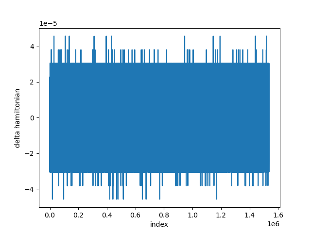
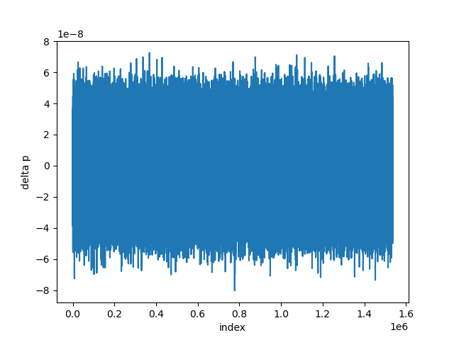
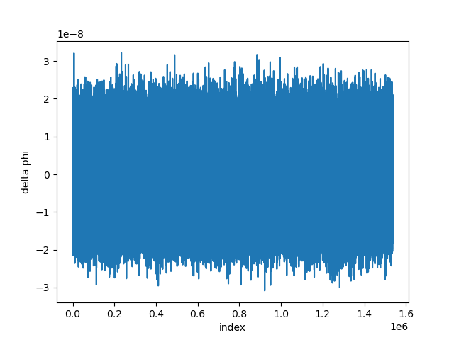
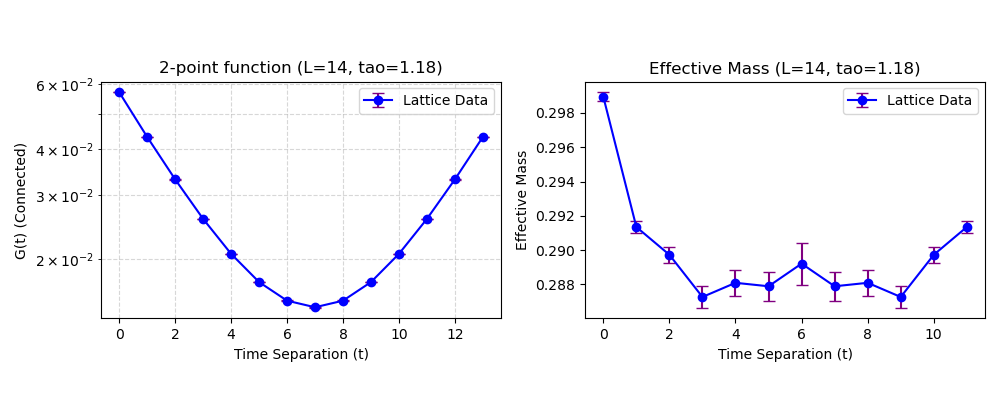

# Report on the 2-dim lattice $\phi^{4}$ simulations with HMC algorithm

**Date:** January 20, 2026
**Algorithm:** Hybrid Monte Carlo (HMC)

This is a report on the 2-dim lattice $\phi^4$ simulations using the HMC algorithm. The results presented below are based on the execution of the `test_4.py` script.

## 1. HMC Hamiltonian

The HMC Hamiltonian is defined by:

$$
H(p,\phi) = \sum_{n}\frac{1}{2}p(n)^{2} + S(\phi), \tag{1.1}
$$

where the action $S(\phi)$ is:

$$
S(\phi) = \sum_{n}\phi(n) \left[ \sum_{\mu=1}^{2}(-\phi(n+\hat{\mu}) + \phi(n) - \phi(n-\hat{\mu})) + m^{2}\phi(n) + \lambda\phi(n)^{4} \right] \tag{1.2}
$$

Here, $p(n)$ and $\phi(n)$ are real-valued 2-dimensional arrays (lattice fields) with periodic boundary conditions imposed on $\phi(n)$.

## 2. Molecular dynamics evolution equation used in HMC

The momentum $p(n)$ evolution follows Hamilton's equations of motion. Based on the conservation of energy $\dot{H}=0$, the equation of motion for $p(n)$ is derived as:

$$
\dot{p}(n) = -\frac{\partial S}{\partial \phi(n)} = - \left( 2 \sum_{\mu=1}^{2} (-\phi(n+\hat{\mu}) + 2\phi(n) - \phi(n-\hat{\mu})) + 2m^{2}\phi(n) + 4\lambda\phi(n)^{3} \right) \tag{2.3}
$$

In the code, the discrete Laplacian is implemented via `torch.roll`, consistent with this derivation.

## 3. MD integrator

The simulation uses the **Leapfrog integrator**.
* Trajectory length: $\tau = 1.18$
* MD steps per trajectory: $N_{MD} = 10$
* Step size: $\epsilon = 0.118$

## 4. Numerical results

### 4.1 Simulation Parameters

The simulation parameters used in `test_4.py` are:
* **Lattice Size:** $N_t = N_x = L = 14$
* **Mass Parameter:** $m^2 = -4.0$
* **Coupling Constant:** $\lambda = 5.113$
* **Total Samples:** $1,536,000$ (Accumulated after binning/saving)

### 4.2 MD Reversibility and Conservation

We measured the reversibility of the Molecular Dynamics (MD) trajectory by evolving forward and then backward in fictitious time. The metrics are defined as the deviation in Hamiltonian ($\Delta H$), Momentum ($\Delta p$), and Field ($\Delta \phi$).

**$\Delta H$ (Hamiltonian Deviation):**
The deviation oscillates cleanly around zero with a magnitude of approximately $10^{-5}$, indicating stable energy conservation.

**$\Delta p$ (Momentum Deviation):**
The reversibility error for momentum is on the order of $10^{-8}$.

**$\Delta \phi$ (Field Deviation):**
The reversibility error for the field configuration is on the order of $10^{-8}$.

### 4.3 HMC Statistics

The following table summarizes the HMC statistics, including the mean change in Hamiltonian ($\langle dH \rangle$) and the required area preservation condition $\langle \exp[-dH] \rangle \approx 1$.

| Metric | Value (Error) |
| :--- | :--- |
| $\langle dH \rangle$ | $0.29203(60)$ |
| $\langle \exp[-dH] \rangle$ | $1.0000(7)$ |
| **Acceptance Ratio** | **$0.70420(12)$** |

The condition $\langle \exp[-dH] \rangle = 1$ holds within statistical error, confirming the validity of the sampling.

### 4.4 Moments of $\phi(n)$

We measured the moments $\mu_p \equiv \frac{1}{V} \sum_n \langle \phi(n)^p \rangle$. As expected, odd moments are consistent with zero within error margins.

| Moment Order ($p$) | $\mu_p$ Value |
| :--- | :--- |
| **1** | $2.87(2.68) \times 10^{-4}$ |
| **2** | $0.218432(18)$ |
| **3** | $1.15(1.09) \times 10^{-4}$ |
| **4** | $0.090695(12)$ |
| **5** | $6.24(5.40) \times 10^{-5}$ |

### 4.5 Two-point Function and Effective Mass

The connected two-point Green's function $G_c(t)$ and the effective mass $m_{eff}(t)$ were calculated.

$$
m_{eff}(n_t) = \cosh^{-1}\left[ \frac{\tilde{G}_c(n_t-1) + \tilde{G}_c(n_t+1)}{2\tilde{G}_c(n_t)} \right]
$$

**Two-point Function Data ($G(t)$):**

| $t$ | $G_c(t)$ | Error |
| :--- | :--- | :--- |
| 0 | $5.71017 \times 10^{-2}$ | $3.15 \times 10^{-5}$ |
| 1 | $4.31322 \times 10^{-2}$ | $3.20 \times 10^{-5}$ |
| 2 | $3.30462 \times 10^{-2}$ | $3.31 \times 10^{-5}$ |
| 3 | $2.57852 \times 10^{-2}$ | $3.48 \times 10^{-5}$ |
| 4 | $2.07039 \times 10^{-2}$ | $3.69 \times 10^{-5}$ |
| 5 | $1.73430 \times 10^{-2}$ | $3.90 \times 10^{-5}$ |
| 6 | $1.54315 \times 10^{-2}$ | $4.11 \times 10^{-5}$ |
| 7 | $1.48078 \times 10^{-2}$ | $4.21 \times 10^{-5}$ |
| 8 | $1.54315 \times 10^{-2}$ | $4.11 \times 10^{-5}$ |
| 9 | $1.73430 \times 10^{-2}$ | $3.90 \times 10^{-5}$ |
| 10 | $2.07039 \times 10^{-2}$ | $3.69 \times 10^{-5}$ |
| 11 | $2.57852 \times 10^{-2}$ | $3.48 \times 10^{-5}$ |
| 12 | $3.30462 \times 10^{-2}$ | $3.31 \times 10^{-5}$ |
| 13 | $4.31322 \times 10^{-2}$ | $3.20 \times 10^{-5}$ |

**Plots:**
The figure below displays the Two-point function (left) and the Effective Mass (right). The effective mass shows a plateau consistent with theoretical expectations for these simulation parameters.

