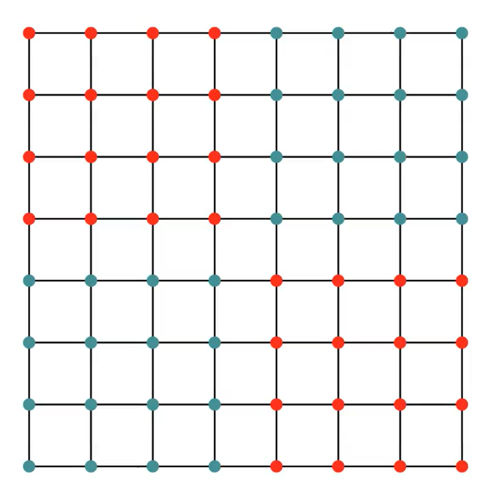
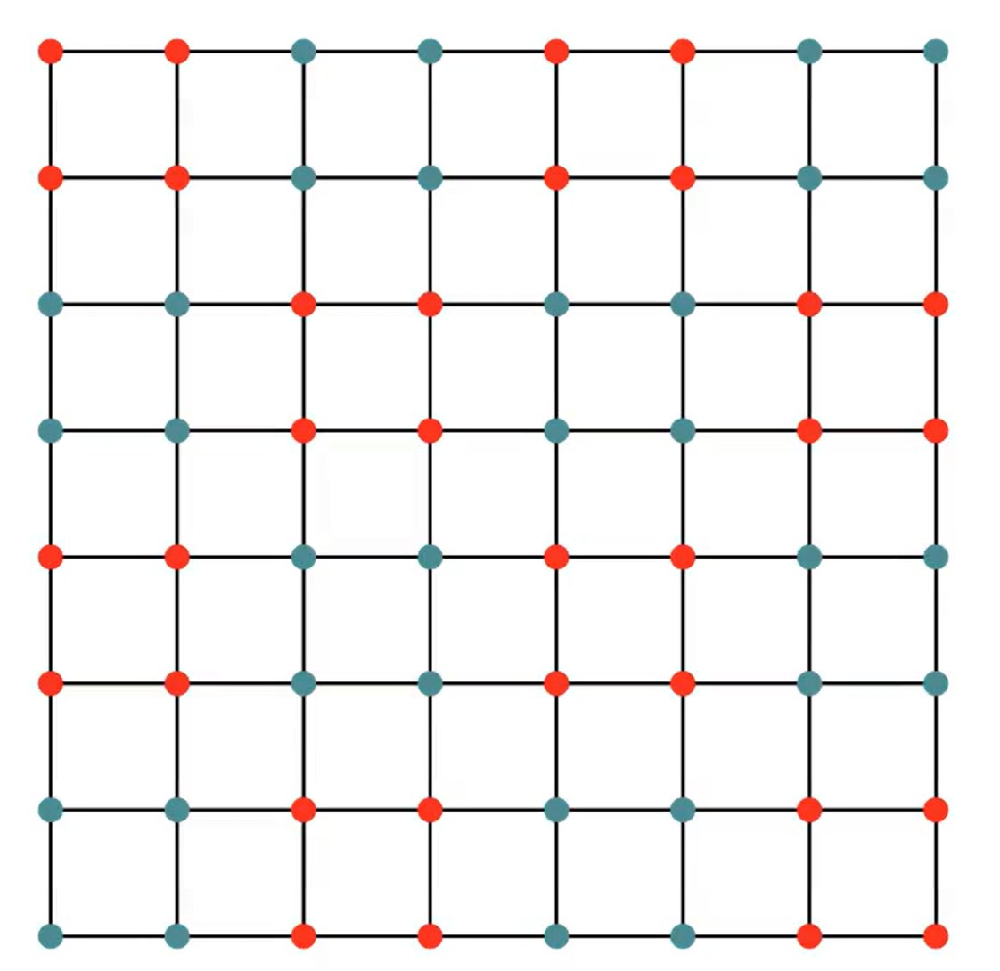
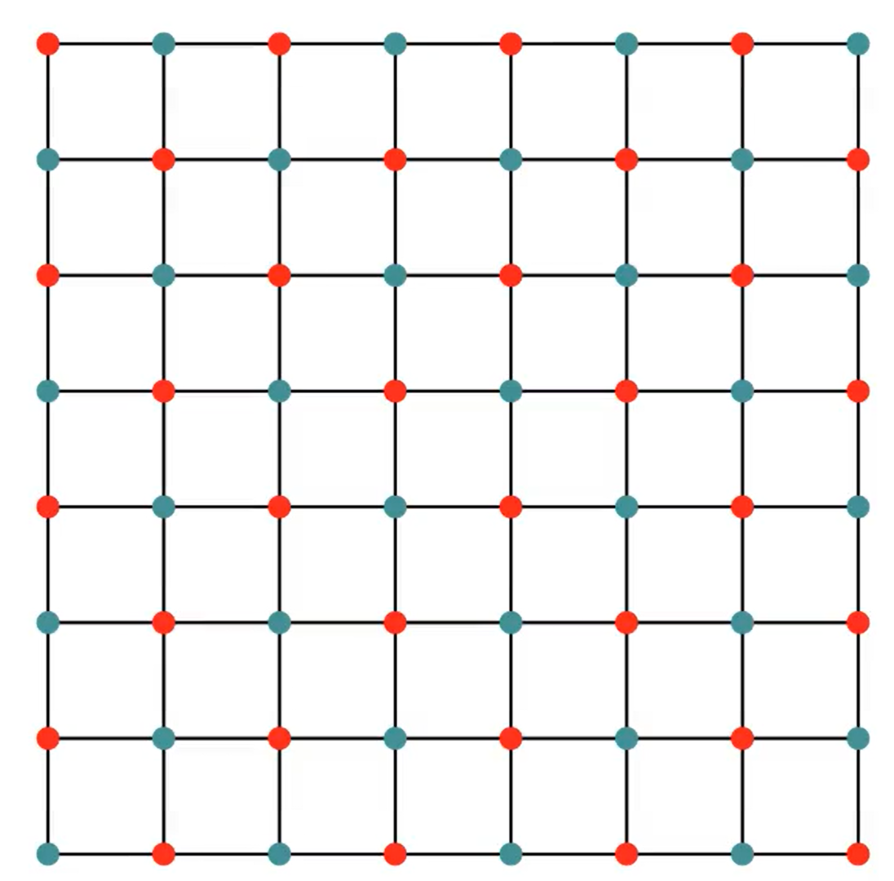

# Report: Enhancing Flow-Based Generative Models for Lattice Field Theory via Free-Field Pre-Sampling

---

## 1. Motivation and Problem Statement

In the application of Normalizing Flows (such as RealNVP) to generate configurations for Lattice $\phi^4$ theory, the standard approach involves mapping a base standard normal distribution to the target Boltzmann distribution $p(\phi) \propto e^{-S(\phi)}$.

A fundamental structural limitation arises when utilizing a **checkerboard mask** to update the lattice. To accurately evaluate the kinetic term (which involves the d'Alembertian/Laplacian operator $\Box$), the neural network requires the information of a specific lattice site *and* its four nearest neighbors. 

Under the checkerboard masking scheme, the lattice is partitioned into two sets: $\phi_a$ (frozen) and $\phi_b$ (active). When updating the active partition $\phi_b$ using the frozen partition $\phi_a$ as the context, the network only has access to the nearest neighbors located in $\phi_a$. **Crucially, we cannot use the information of the site being updated to update itself.** The network is completely blind to the self-information of the $\phi_b$ sites at the current step. 

Although the neighboring $\phi_a$ sites contain historical information about the field, this update mechanism introduces an inherent "lag" in information propagation. It forces the network to infer the local center-point dynamics entirely from surrounding points, making it exceptionally difficult to learn the correct spatial correlations of the kinetic term from scratch.

To resolve this connectivity bottleneck, I propose using **Free-Field Pre-sampling** as the base distribution. By injecting the kinetic correlations into the initial samples, we bypass the spatial lag caused by the mask.

---

## 2. Theoretical Framework and Detailed Derivations

To solidify this approach, we must mathematically derive how to perfectly sample a free field and subsequently demonstrate why this pre-sampling accelerates neural network training using Kullback-Leibler (KL) divergence.

### 2.1. The Continuous Free-Field Action
The action for a free scalar field in Euclidean space consists of a kinetic term and a mass term:
$$S_{free} = \int d^4x \left( \frac{1}{2} \partial^\mu \phi \partial_\mu \phi + \frac{1}{2} m_{free}^2 \phi^2 \right)$$

We can rewrite the kinetic term using integration by parts:
$$\int \partial^\mu \phi \partial_\mu \phi \, d^4x = \int \left[ \partial^\mu (\phi \partial_\mu \phi) - \phi \partial^2 \phi \right] d^4x$$
Assuming periodic boundary conditions, the surface term $\partial^\mu (\phi \partial_\mu \phi)$ evaluates to zero. Thus, the action becomes:
$$S_{free} = \frac{1}{2} \int d^4x \left( - \phi \partial^2 \phi + m_{free}^2 \phi^2 \right)$$

On a discrete lattice with spacing $u=1$, the continuous Laplacian $\partial^2$ is replaced by the finite difference operator:
$$\partial^2 \phi(x) \approx \sum_{\mu} \left[ \phi(x+\hat{\mu}) - 2\phi(x) + \phi(x-\hat{\mu}) \right]$$

### 2.2. Transformation to Momentum Space and Positive-Definiteness
To diagonalize the action, we apply a Fourier transform to move from position space to momentum space:
$$\phi(x) = \int \frac{dk}{(2\pi)^4} \tilde{\phi}(k) e^{-ikx}$$
Applying the derivatives in Euclidean space yields $-\partial^2 \to k^2$. Substituting this into the action gives us a decoupled, diagonalized form in momentum space:
$$S_{free} = \frac{1}{2} \int \frac{dk}{(2\pi)^4} \tilde{\phi}^*(k) \left( k^2 + m_{free}^2 \right) \tilde{\phi}(k)$$

**Crucial Note on the Propagator:** To ensure that the propagator $(k^2 + m_{free}^2)^{-1}$ is positive-definite and that the sampling process remains stable, we explicitly choose a strictly positive mass squared parameter ($m_{free}^2 > 0$) for the pre-sampling free field.

### 2.3. The Free-Field Sampling Strategy
The target probability distribution for the free field is given by the Boltzmann weight:
$$P(\tilde{\phi}) \propto \exp(-S_{free}) = \exp \left( - \frac{1}{2} \int \tilde{\phi}^*(k) \left( k^2 + m_{free}^2 \right) \tilde{\phi}(k) \frac{dk}{(2\pi)^4} \right)$$

To sample this efficiently, we introduce a change of variables:
$$\tilde{\gamma}(k) = \tilde{\phi}(k) \sqrt{k^2 + m_{free}^2}$$
Substituting $\tilde{\phi}(k) = \frac{\tilde{\gamma}(k)}{\sqrt{k^2 + m_{free}^2}}$ back into the probability distribution yields:
$$P(\tilde{\gamma}) \propto \exp \left( - \frac{1}{2} \int |\tilde{\gamma}(k)|^2 \frac{dk}{(2\pi)^4} \right)$$
This reveals that $P(\tilde{\gamma})$ is simply a **standard multivariate normal distribution** $\mathcal{N}(0, I)$. 

**The exact sampling algorithm is:**
1. Sample independent Gaussian noise in momentum space: $\tilde{\gamma}(k) \sim \mathcal{N}(0, 1)$.
2. Inject the physical correlations: $\tilde{\phi}(k) = \frac{\tilde{\gamma}(k)}{\sqrt{k^2 + m_{free}^2}}$.
3. Apply the Inverse Fast Fourier Transform (IFFT) to obtain the position-space free field $\phi(x)$.

### 2.4. KL Divergence and Ultra-Local Residual Learning
The Normalizing Flow is trained by minimizing the reverse KL divergence:
$$\mathcal{L} = \mathbb{E}_{\phi \sim q_\theta}[ \log q_\theta(\phi) + S_{target}(\phi) ]$$
Because we are starting from an artificial free field with $m_{free}^2 > 0$, the total target action is separated as $S_{target}(\phi) = S_{free}(\phi) + S_{int}(\phi)$, where the residual interaction term is:
$$S_{int}(\phi) = \sum \left( \lambda \phi^4 + \Delta m^2 \phi^2 \right)$$
*(Note: The network must learn both the $\lambda \phi^4$ interaction and the mass correction term, such as a $2m^2\phi^2$ shift, to bridge the artificial $m_{free}^2$ and the true target mass).*

By initializing our flow with the free-field base distribution $q_0(\phi) \propto e^{-S_{free}}$, the loss function becomes:
$$\mathcal{L} = \mathbb{E}_{\phi_{free}} \left[ \log q_0(\phi_{free}) - \log |\det J| + S_{free}(\phi) + S_{int}(\phi) \right]$$
Since $\log q_0(\phi_{free}) = -S_{free}(\phi_{free}) - \log Z_{free}$, during the early stages of training ($\phi \approx \phi_{free}$ and $\det J \approx 1$):
$$-S_{free}(\phi_{free}) + S_{free}(\phi) \approx 0$$
**The non-local kinetic terms analytically cancel out in the loss function.** The residual interaction term $S_{int} = \sum (\lambda \phi_a^4 + \lambda \phi_b^4 + \Delta m^2 \phi_a^2 + \Delta m^2 \phi_b^2)$ is **ultra-local**, meaning there are no cross-terms between adjacent lattice sites. Therefore, even if we use a checkerboard mask for a half-step update (updating $\phi_b$ using information from $\phi_a$), the underlying physical correlation $\phi_a = V(\phi_b)$ is already intrinsically embedded within the free-field base distribution. 

The network only needs to learn the local mapping via $\phi_b' = f(V^{-1}\phi_a)$. **Pre-sampling liberates the network from the exceptionally difficult task of learning non-local differential correlations, allowing it to focus exclusively on local non-linear transformations. This profoundly enhances learning efficiency.**

---

## 3. Experimental Setup & Architectures

To empirically validate the necessity of spatial connectivity and the superiority of pre-sampling, two sets of experiments were conducted.

### 3.1. Block Partitioning Configurations
We tested splitting the lattice into 2, 4, and 8 blocks. A higher number of blocks means that the active points are surrounded by more frozen "context" points, increasing the available spatial information during a single update step.

| Block 2 (Half-Lattice) | Block 4 (Stripes) | Block 8 (Checkerboard) |
| :---: | :---: | :---: |
|  |  |  |

### 3.2. Network Architecture and Hyperparameters

**Experiment 1: $8 \times 8$ Lattice (Block Partition & Pre-processing)**
* **Lattice Size:** $8 \times 8$
* **Coupling Layers:** 10 layers
* **Hidden Layers:** 6 hidden layers per block, utilizing a Residual Network (ResNet) architecture
* **Conv Setting:** $3 \times 3$ convolutional kernels, 16 channels
* **Training Steps:** 15,000 steps
* **Learning Rate:** Dynamic cosine decay from $1 \times 10^{-3}$ down to $1 \times 10^{-5}$

**Experiment 2: $14 \times 14$ Lattice (Overall Pre-processing Impact)**
* **Lattice Size:** $14 \times 14$
* **Coupling Layers:** 16 layers
* **Other Configurations:** Identical to Experiment 1 (6 ResNet hidden layers, 15,000 steps, LR $10^{-3} \to 10^{-5}$)

---

## 4. Results and Analysis

### 4.1. $8 \times 8$ Lattice: Partitioning vs. Pre-processing
.png)

**Observations:**
1. **Connectivity Matters (Solid Lines):** Even without pre-processing, the Block 8 configuration converges much faster than Block 2 or Block 4. This validates the hypothesis: when the network cannot use a site's self-information, maximizing the availability of its immediate neighbors is critical.
2. **Pre-sampling Dominance (Dashed Lines):** Free-field pre-processing universally accelerates learning. Remarkably, the pre-processed Block 2 model outperforms the standard Block 8 model. The pre-processed Block 8 model achieves the deepest convergence in the shortest time.

### 4.2. $14 \times 14$ Lattice: Overall Performance Gain

Scaling the lattice up to $14 \times 14$ confirms the scalability of the method. Model 1 (with Free-Field Pre-sampling) achieves a strictly lower loss bound and lower variance compared to Model 2 (Standard Gaussian). This directly reflects the analytical KL-divergence cancellation derived in Section 2.4.

### 4.3. Metropolis-Hastings Acceptance Rate Evaluation

To further quantify the exactness and quality of the generated distributions, we evaluated the Metropolis-Hastings (MH) acceptance rate for the configurations generated on the $14 \times 14$ lattice. In flow-based MCMC approaches, the acceptance rate is a critical metric: a higher rate indicates that the generative model's learned distribution more closely approximates the true target Boltzmann distribution.

After 15,000 training steps (evaluated in single precision), the acceptance rates were recorded as follows:

* **Model 1 (Free-Field Pre-sampling):** 49.23%
* **Model 2 (Standard Normal Base / CNN ResNet):** 39.80%

**Analysis:**
The Free-Field Pre-sampling model achieves nearly 10% in the MH acceptance rate over the standard baseline. This boost provides concrete evidence that injecting physical spatial correlations (the kinetic term) into the base distribution allows the network to generate configurations that are structurally much closer to the true physical equilibrium states. As a result, the rejection rate during the Markov Chain Monte Carlo sampling phase is drastically reduced, leading to higher overall sampling efficiency.
---

## 5. Conclusion

This study identifies the connectivity bottleneck in Normalizing Flows for Lattice QFT and shows how a physical prior solves it. The main takeaways are:

* **Bypassing the Masking Limit:** The checkerboard mask hides the target sites ($\phi_b$), forcing the network to guess local dynamics using only the neighbors ($\phi_a$). This makes learning the kinetic operator ($\Box$) very difficult. Free-field pre-sampling solves this by putting the correct spatial correlations directly into the starting field.
* **Faster Initial Training:** The free-field prior helps the model quickly pass the initial training barrier. Since long-range correlations are handled "for free," the network can immediately focus on learning local interactions (like $\lambda\phi^4$). This explains the sharp early drop in loss and leads to faster convergence.
* **CNN Kernel Size Matters:** Even with the kinetic info pre-coded, the block size still affects learning speed. This shows that long-range correlations still matter, meaning the CNN kernel size (receptive field) is a very important parameter.

**Theoretical Outlook:** Theoretically, this architecture shifts the Normalizing Flow from a "black box" into a "non-perturbative correction operator" that simply maps a free field to an interacting field.