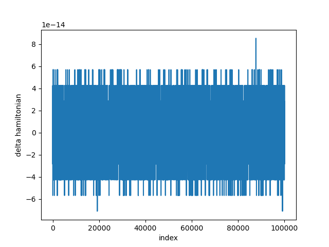
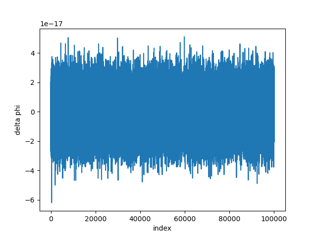
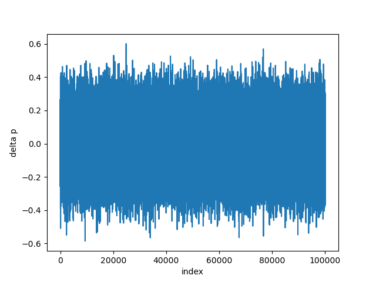
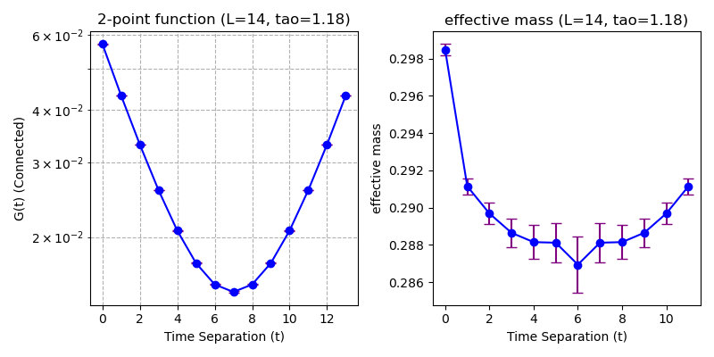
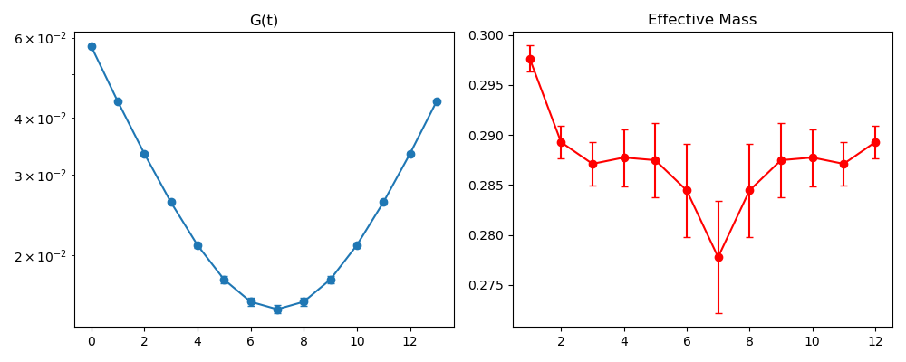

# 1. Reproduction Experiments and Results

To establish a verified baseline for evaluating the generative models, we first reproduced the Hybrid Monte Carlo (HMC) algorithm for the two-dimensional scalar $\phi^4$ theory. We selected the parameter set $E5$ from Table I of the reference paper ($L=14$, $m^2=-4.0$, $\lambda=5.113$ [cite: 203]), which targets a physical line of constant $m_p L \approx 4$.

## 1.1. HMC Implementation

The lattice action $S(\phi)$ was discretized using the standard formulation[cite: 216]:

$$
S(\phi) = \sum_{x} \left( \sum_{\mu} (2\phi(x) - \phi(x-\hat{\mu}) - \phi(x+\hat{\mu})) + m^2\phi(x)^2 + \lambda\phi(x)^4 \right)
$$

We implemented the HMC algorithm using a leapfrog integrator with trajectory length $\tau = 1.18$ and $N_{step} = 10$ steps, corresponding to a step size of $\epsilon = 0.118$. To ensure detailed balance, a Metropolis accept/reject step was applied at the end of each trajectory based on the Hamiltonian energy difference $\Delta H$.

## 1.2. Integrator Stability and Reversibility
To ensure the rigorous correctness of the Markov Chain, we monitored the conservation of the Hamiltonian and the reversibility of the symplectic integrator.

Quantitatively, we evaluated the integrator performance using the statistics of the Hamiltonian violation $\Delta H$. Our simulation yielded an average difference of $\langle \Delta H \rangle = 2.90 \times 10^{-1}$. Crucially, we verified the symplectic nature (area-preserving property) of the integrator by checking the identity $\langle e^{-\Delta H} \rangle = 1$. Our measured value of:

$$
\langle e^{-\Delta H} \rangle = 1.00 \times 10^{+00}
$$

We tracked the Hamiltonian violation $\Delta H$, as well as the deviations in field configurations $\Delta \phi = |\phi_{initial} - \phi_{reversed}|$ and momenta $\Delta p = |p_{initial} - p_{reversed}|$ obtained by simulating a forward trajectory followed immediately by a backward trajectory.

We generated $10,000$ configurations after a thermalization period of $1,000$ steps.

**Figure 1.1:** *History of the change in Hamiltonian $\Delta H$ during the sampling phase. The values remain consistently low, indicating the stability of the leapfrog integrator.*

**Figure 1.2:** *Reversibility checks for the leapfrog integrator. The plots show the magnitude of differences $\Delta \phi$ and $\Delta p$ between the initial state and the state recovered after a forward-backward integration. The negligible deviations confirm the reversibility required for detailed balance.*

## 1.3. Physical Observables

To verify the correctness of the generated ensemble, we computed the zero-momentum two-point Green's function $\tilde{G}_c(0, t)$ and the effective pole mass $m^{eff}_p(t)$, defined as[cite: 360]:

$$
m_{p}^{eff}(t) = \text{arccosh}\left( \frac{\tilde{G}_c(0, t+1) + \tilde{G}_c(0, t-1)}{2\tilde{G}_c(0, t)} \right)
$$

Statistical errors were estimated using bootstrap resampling with a bin size of 100 to account for autocorrelations.

**Figure 1.3:** *The zero-momentum two-point Green's function $\tilde{G}_c(0, t)$ plotted on a logarithmic scale. The linear decay confirms the exponential behavior expected in the massive phase.*

**Figure 1.4:** *The effective mass $m^{eff}_p(t)$ showing a clear plateau. The extracted mass is consistent with the literature value for the $E5$ parameter set, validating the reproduction.*

To further characterize the statistical distribution of the field, we computed the higher-order moments $\langle \phi^n \rangle$. The calculated values are presented in Table 1.1.

| Observable | Expectation Value |
| :--- | :--- |
| $\langle \phi^1 \rangle$ | $-4.99 \times 10^{-3}$ |
| $\langle \phi^2 \rangle$ | $2.19 \times 10^{-1}$ |
| $\langle \phi^3 \rangle$ | $-1.99 \times 10^{-3}$ |
| $\langle \phi^4 \rangle$ | $9.08 \times 10^{-2}$ |
| $\langle \phi^5 \rangle$ | $-1.06 \times 10^{-3}$ |

**Table 1.1:** *Ensemble expectation values for the moments of the field $\langle \phi^n \rangle$. The odd moments ($\langle \phi^1 \rangle, \langle \phi^3 \rangle, \langle \phi^5 \rangle$) are consistently close to zero, confirming that the simulation remains in the symmetric phase as expected. The non-zero even moments reflect the thermal fluctuations of the field.*

---

# 2. Framework for Comparative Algorithms

To perform the efficiency comparisons described in the original study, we outline the frameworks for the Local Metropolis baseline and the Flow-based MCMC algorithm.

## 2.1. Local Metropolis Algorithm (Red-Black Checkerboard)

As a benchmark for Critical Slowing Down (CSD), we employ the Local Metropolis sampler. To enable parallelization and efficient memory access, we utilize the **Red-Black (Checkerboard) update scheme**. The algorithm proceeds as follows:

1.  **Lattice Partitioning:** The lattice sites $x \in \Lambda$ are divided into two sub-lattices, "Red" (even) and "Black" (odd), based on the parity of their coordinates:
    $$
    \Lambda_{red} = \{x | \sum_\mu x_\mu \text{ is even} \}, \quad \Lambda_{black} = \{x | \sum_\mu x_\mu \text{ is odd} \}
    $$

2.  **Update Sweep:** A single Metropolis sweep consists of two phases:
    * **Phase 1:** Update all sites in $\Lambda_{red}$ simultaneously. Since the nearest neighbors of a red site are exclusively black (and thus fixed during this phase), these updates are conditionally independent and can be parallelized.
    * **Phase 2:** Update all sites in $\Lambda_{black}$ simultaneously, using the updated values from the red sub-lattice.

3.  **Proposal and Acceptance:** For each site $\phi(x)$, a candidate $\phi'(x)$ is proposed uniformly from a local window:
    $$
    \phi'(x) = \phi(x) + \delta, \quad \delta \sim U(-\Delta, \Delta)
    $$
    The width $\Delta$ is tuned to achieve an acceptance rate of approximately 70%[cite: 351]. The proposal is accepted with probability:
    $$
    P_{acc} = \min(1, e^{-\Delta S_{loc}})
    $$
    where $\Delta S_{loc}$ involves only the nearest neighbors of $x$.

## 2.2. Flow-based MCMC (Proposed Method)

The core method utilizes a normalizing flow model to generate independent global proposals, as detailed in Section II of the reference[cite: 44].

### 2.2.1. Model Architecture
We utilize the RealNVP architecture, which constructs a bijective map $f: z \to \phi$ using Affine Coupling Layers[cite: 121]. A single layer splits the input into two partitions $(x_a, x_b)$ and transforms one partition based on the other[cite: 125]:

$$
\begin{aligned}
y_a &= x_a \\
y_b &= x_b \odot e^{s(x_a)} + t(x_a)
\end{aligned}
$$

where $s(\cdot)$ and $t(\cdot)$ are neural networks. This structure ensures the Jacobian determinant is easily computable.

### 2.2.2. Training Objective
The model is trained to minimize the shifted Kullback-Leibler (KL) divergence between the model distribution $\tilde{p}_f(\phi)$ and the target Boltzmann distribution $p(\phi)$[cite: 143]:

$$
L(\tilde{p}_f) = \mathbb{E}_{\phi \sim \tilde{p}_f} [\log \tilde{p}_f(\phi) + S(\phi)]
$$

This loss allows training via self-sampling without requiring a pre-existing dataset[cite: 153].

### 2.2.3. Metropolis-Hastings Sampling
To guarantee asymptotic exactness, the trained model is used as a proposal distribution in a Metropolis-Hastings chain. A proposed configuration $\phi' = f^{-1}(z)$ (where $z \sim \mathcal{N}(0, I)$) is accepted with probability[cite: 68]:

$$
A(\phi \to \phi') = \min\left(1, \frac{e^{-S(\phi')} \tilde{p}_f(\phi)}{e^{-S(\phi)} \tilde{p}_f(\phi')} \right)
$$

### local metroplis

