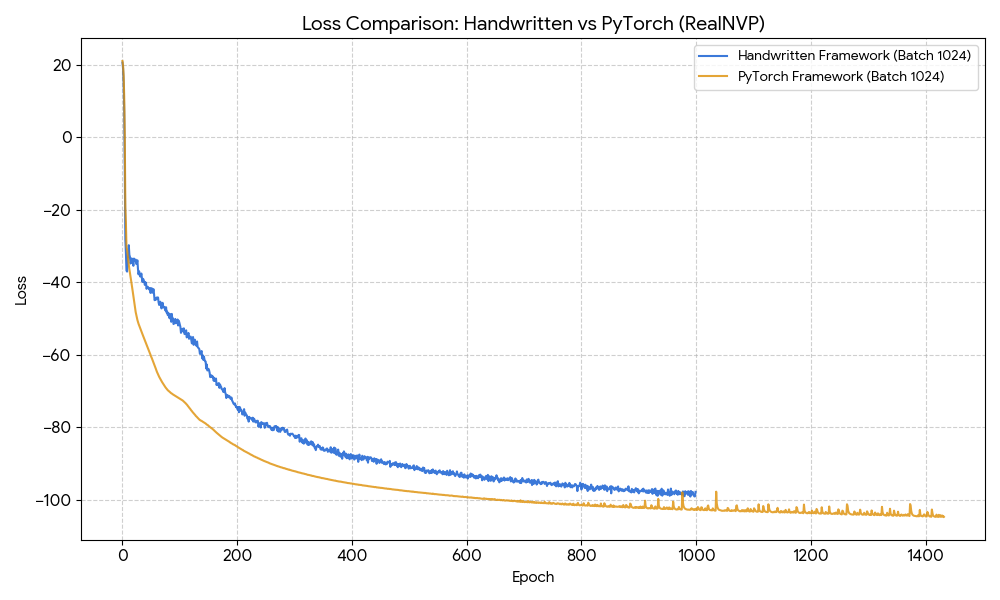

# RealNVP for Lattice Field Theory: Detailed Derivation and Framework Comparison

## 1. Experimental Parameters & Configuration

* **Lattice Geometry**: $L=14$ (Total dimensions: $14 \times 14 = 196$).
* **Transformation Depth**: 8 Coupling Layers.
* **Network Architecture (s & t networks)**:
    * **Internal Layers**: 2 hidden layers per network.
    * **Hidden Dimension**: 128 units.
    * **Activation**: `LeakyReLU(0.1)`.
* **Data Precision**: `float64` (Double precision).
* **Optimization**: Adam optimizer with a Batch Size of 1024.

---

## 2. Loss Function Derivation
The objective is to minimize the Kullback-Leibler (KL) divergence between the transformed distribution $p(\phi)$ and a target Gaussian $N(z)$.

### 2.1 Change of Variables
Based on the principle of probability conservation:
$$\int r(z) dz = \int p(\phi) d\phi \implies r(z) \left| \det \frac{\partial z}{\partial \phi} \right| d\phi = p(\phi) d\phi$$
This leads to the density relation:
$$p(\phi) = r(z) \left| \det \frac{\partial z}{\partial \phi} \right|$$

### 2.2 KL Divergence to Loss
Starting from the KL divergence between the current distribution $r(z)$ and the target Gaussian $N(z)$:
$$KL(r(z) \parallel N(z)) = \int r(z) (\log r(z) - \log N(z)) dz$$
Substituting $r(z) = p(\phi) \left| \det \frac{\partial z}{\partial \phi} \right|^{-1}$ and $dz = \left| \det \frac{\partial z}{\partial \phi} \right| d\phi$:
$$= \int p(\phi) \left| \det \frac{\partial z}{\partial \phi} \right|^{-1} \left[ \log p(\phi) - \log \left| \det \frac{\partial z}{\partial \phi} \right| - \log N(z_\phi) \right] \left| \det \frac{\partial z}{\partial \phi} \right| d\phi$$
$$= \int p(\phi) \left[ \log p(\phi) - \log \left| \det \frac{\partial z}{\partial \phi} \right| - \log N(z_\phi) \right] d\phi$$
Discretizing over $N$ samples $\phi_i$:
$$\Rightarrow \frac{1}{N} \sum_{\phi_i}^{N} \left[ \log p(\phi_i) - \log \left| \det \frac{\partial z_\theta}{\partial \phi_i} \right| - \log N(z_\theta) \right]$$

### 2.3 Final Training Objective
Ignoring terms independent of the network parameters $\theta$ (like $\log p(\phi)$) and using $N(z) \propto e^{-z^2}$:
$$\Rightarrow Loss = \frac{1}{N} \sum_{i=1}^{N} \left[ -\log \left| \det \frac{\partial z_\theta}{\partial \phi_i} \right| + z^2 \right]$$
In my code, this corresponds to: `loss = (-1 * log_total_jacobian - log_r_z) / batch_size`.

---

## 3. Experimental Results Comparison

### 3.1 Loss Convergence Performance

---

## 4. Conclusion and Future Improvements

1.  **Framework Consistency**: The 8-layer RealNVP implementation for the $14 \times 14$ lattice is mathematically sound across both frameworks.
2.  **Implementation Recommendations**:
    * **Tanh Constraint**: Add `torch.tanh(s_out) * alpha` to the output of the scaling networks to prevent numerical explosions.
    * **Adaptive Learning Rate**