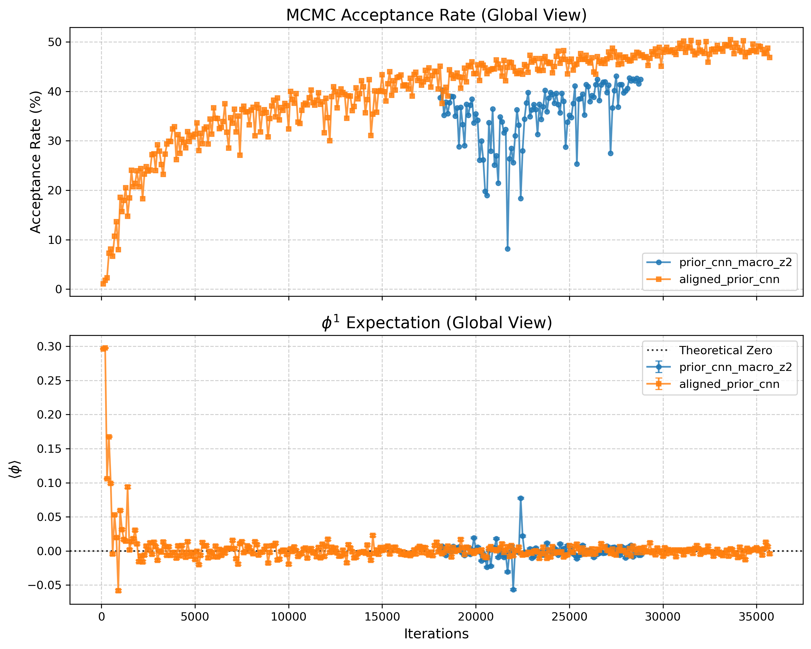

# 模型架构、优化与物理对称性的引入

在第四节我们介绍了神经网络和normalizing flow 算法，对于normalizing flow算法的具体实现，我们必须借助神经网络，接下来我们会具体介绍本论文中使用的神经网络的具体架构。

\subsection{神经网络总体架构}

如图中所示（引用 \label{fig:network_structure}），in the formal training, our neural network is configured with 12 coupling layers. Each coupling layer contains 3 residual blocks and two branch networks that each contain 1 residual block. The outputs of these 3 residual blocks are treated as inputs entering the branch networks for training, and then these two branch networks output $s^i$ and $t^i_{\theta}$ respectively, where $i$ represents the $i$-th coupling layer. Each residual block contains two convolutional layers connected via a residual connection. In addition, during initialization, we set all parameters of the last convolutional layer of each coupling layer to 0. In this way, the $s^i$ and $t^i_{\theta}$ output by each layer are correspondingly 0, which guarantees that our network is close to an identity mapping at the initial stage of training under the affine transformation. Other hidden layers are initialized with a Gaussian distribution with a mean of 0 and a variance of 0.01.

\begin{sidewaysfigure}
    \centering
    \includegraphics[width=\textheight]{network_structure.png}
    \caption{Overall architecture of the convolutional neural network for the normalizing flow.}
    \label{fig:network_structure}
\end{sidewaysfigure}

（然后简要介绍下残差连接，原理和优点，一两句话）

下面我们重点介绍下卷积神经网络的具体原理，以及我们为什么要使用卷积神经网络而不是全连接神经网络。

## 卷积神经网络与平移等变性

在前面的章节中，我们介绍了全连接网络（FCN）。将FCN直接应用于晶格场论面临着实际挑战：参数数量与晶格体积$V=L^2$的平方成正比激增。对于具有$V$个自由度的输入，稠密权重矩阵的尺度通常为$O(V^2)$。这会带来巨大的内存和计算开销，使得模型极难推广到更大的晶格尺寸。

更重要的是，晶格场论中的物理作用量具有空间平移对称性。换句话说，控制系统的物理定律并不依赖于晶格格点的绝对位置，而仅仅取决于相邻格点之间的相对关系。如果使用普通的FCN，网络本质上是无法感知这种结构的，必须在训练过程中从头开始重新学习这种平移不变性，这是极其低效的。

为了解决这个问题，我们将流模型（flow model）中的上下文网络（context networks）替换为卷积神经网络（CNN）。CNN的核心计算组件是卷积核和通道。假设我们有一个形状为$C_{\mathrm{in}} \times L \times L$的二维输入场$\mathbf{h}^{(l-1)}$，其中$C_{\mathrm{in}}$是输入通道数，$L$是晶格维度。卷积操作通过在输入数据上滑动一个小的权重矩阵（例如$3 \times 3$的卷积核），在每个局部邻域内计算加权和。

对于第$l$层的第$c_{\mathrm{out}}$个输出通道，位置$(x,y)$处的输出由下式给出：
$$h^{(l)}_{c_{\mathrm{out}}}(x,y)=\sigma\left(\sum_{c_{\mathrm{in}}=1}^{C_{\mathrm{in}}}\sum_{i=-k}^{k}\sum_{j=-k}^{k}W^{(l)}_{c_{\mathrm{out}},c_{\mathrm{in}}}(i,j)h^{(l-1)}_{c_{\mathrm{in}}}(x+i,y+j)+b^{(l)}_{c_{\mathrm{out}}}\right),$$
其中：
* $W^{(l)}$是第$l$层的卷积核；
* 卷积核的尺寸为$(2k+1)\times(2k+1)$；
* $b^{(l)}_{c_{\mathrm{out}}}$是偏置项；
* $\sigma$是非线性激活函数；
* $(x+i,y+j)$表示以$(x,y)$为中心的局部邻域。

如该公式所示，整个晶格上的所有位置共享同一套卷积权重$W$。这种权重共享机制极大地压缩了参数空间。更准确地说，CNN中可训练参数的数量主要由卷积核大小、通道数和网络深度决定，并不直接与晶格体积$V=L^2$成正比。当然，前向和反向传播的计算成本仍然随着格点数量$V$的增加而增长，但与FCN的$O(V^2)$尺度相比，CNN从根本上更适合晶格系统。

对于具有周期性边界条件的物理系统，在卷积计算中必须正确处理边界效应。晶格场论通常采用周期性边界条件，定义为：
$$\phi(x+L\hat{\mu})=\phi(x).$$
因此，我们在CNN中使用循环填充（circular padding）。当卷积核滑动到晶格边缘时，它会自动环绕并从对侧读取数值，从而完美地遵从周期性晶格的物理拓扑结构。

在这种配置下，CNN自然表现出平移等变性（translational equivariance）。设$T_a$为将场配置平移$a$个晶格格点的算符。一个理想的卷积网络满足：
$$f_\theta(T_a\phi)=T_a f_\theta(\phi).$$
这意味着将输入场平移一定距离后通过网络，其结果与将原始场通过网络后再将输出平移相同距离的结果完全一致。网络不再承担从数据中学习平移对称性的负担，因为这种对称性已由卷积架构和循环填充在结构上得到了保证。

然而，我们的归一化流（Normalizing Flow）模型在更新时采用了一种棋盘掩码（checkerboard masking）策略。棋盘掩码将晶格格点划分为两个不同的子晶格，通常称为“黑”点和“红”点。由于单个耦合层仅更新一半的格点而冻结另一半，固定的棋盘掩码明确地区分了这两个子晶格。单格点平移（$1a$）会交换黑红子晶格，因为红黑格点进入网络的顺序不一致，导致后续格点更新所依赖的信息也不一致。因此即使我们保持红黑网格的网络参数一致，严格的$1a$平移等变性仍然被打破。

定义掩码矩阵 $M$，其中 $M=1$ 代表黑格点（Frozen），$M=0$ 代表红格点（Updated）。 定义平移 $2a$ 个格点的算符为 $T_{2a}$。根据棋盘晶格的几何性质，掩码在 $2a$ 平移下保持不变： $$T_{2a}M = M, \quad T_{2a}(1-M) = 1-M$$ 同时，由于网络 $s$ 和 $t$ 采用带有循环填充（Circular Padding）的卷积神经网络，其本身满足严格的平移等变性。对于任意输入场 $\psi$： $$T_{2a}t(\psi) = t(T_{2a}\psi), \quad T_{2a}s(\psi) = s(T_{2a}\psi)$$ 并且平移算符与逐点乘法 $\odot$ 对易：$T_{2a}(A \odot B) = (T_{2a}A) \odot (T_{2a}B)$。 

1. 红色格点更新层 $f_r$ 第一步，冻结黑格点（$M$），更新红格点（$1-M$）。网络映射为 $f_r$： $$f_r(\phi) = M \odot \phi + (1-M) \odot \left[ (\phi - t_r(M \odot \phi)) \odot e^{-s_r(M \odot \phi)} \right]$$ 

   我们首先证明单层 $f_r$ 具有 $2a$ 平移等变性。将 $T_{2a}$ 作用于等式两边并分配入内： $$T_{2a} f_r(\phi) = (T_{2a}M) \odot (T_{2a}\phi) + T_{2a}(1-M) \odot \left[ (T_{2a}\phi - T_{2a}t_r(M \odot \phi)) \odot e^{-T_{2a}s_r(M \odot \phi)} \right]$$ 代入掩码的平移不变性 $T_{2a}M = M$，以及 CNN 的等变性 $T_{2a}t_r(M \odot \phi) = t_r(M \odot T_{2a}\phi)$： $$T_{2a} f_r(\phi) = M \odot (T_{2a}\phi) + (1-M) \odot \left[ (T_{2a}\phi - t_r(M \odot T_{2a}\phi)) \odot e^{-s_r(M \odot T_{2a}\phi)} \right]$$ 观察等式右侧，这恰好是将 $T_{2a}\phi$ 作为初始输入代入 $f_r$ 的形式，故： $$T_{2a} f_r(\phi) = f_r(T_{2a}\phi)$$ 

2. 黑色格点更新层 $f_b$ 第二步，冻结红格点（$1-M$），更新黑格点（$M$）。网络映射为 $f_b$： $$f_b(\psi) = (1-M) \odot \psi + M \odot \left[ (\psi - t_b((1-M) \odot \psi)) \odot e^{-s_b((1-M) \odot \psi)} \right]$$   

   同理，将 $T_{2a}$ 作用于等式两边并利用等变性与不变性： $$T_{2a} f_b(\psi) = (1-M) \odot (T_{2a}\psi) + M \odot \left[ (T_{2a}\psi - t_b((1-M) \odot T_{2a}\psi)) \odot e^{-s_b((1-M) \odot T_{2a}\psi)} \right]$$ 由此得出： $$T_{2a} f_b(\psi) = f_b(T_{2a}\psi)$$ 

   

3. 完整流模型 $F$ 的 $2a$ 等变性 一个完整的更新步骤是红黑两层的复合映射： $$F(\phi) = (f_b \circ f_r)(\phi) = f_b(f_r(\phi))$$ 我们将 $T_{2a}$ 作用于整个复合过程： $$T_{2a} F(\phi) = T_{2a} [f_b(f_r(\phi))]$$ 由于 $f_b$ 具备 $2a$ 等变性，平移算符 $T_{2a}$ 可以穿透外部的 $f_b$： $$T_{2a} [f_b(f_r(\phi))] = f_b(T_{2a} f_r(\phi))$$ 接着，由于 $f_r$ 也具备 $2a$ 等变性，平移算符 $T_{2a}$ 继续穿透内部的 $f_r$： $$f_b(T_{2a} f_r(\phi)) = f_b(f_r(T_{2a}\phi))$$ 将结果写回复合形式，证明完毕： $$T_{2a} F(\phi) = F(T_{2a}\phi)$$

因此，尽管CNN本身具有平移等变性，但带有棋盘耦合的整体流架构通常仅保留$2a$平移等变性，而非完整的$1a$等变性，即使我们对红黑网格采用不同的网络参数。这是掩码结构固有的必然结果。

### 耦合层中 的卷积细节

上一subsection提到出于优化参数量和计算量还有平移等变形的要求，在神经网络的连接中我们使用了卷积网络而非全连接网络，在这一subsection我们将会详细展示卷积网络的细节。

如图所示，在每个耦合层其实都是由多层卷积层连接而成，图中的上方展示的是每个耦合层开始时的两层卷积层，下方则是耦合层结束时的两层卷积层。每两层卷积层通过残差连接，我们称为residual block，如之前的图中所示（引用 \label{fig:network_structure}）。

对于L=12,14的lattice size，我们的卷积层的输出通道是32，对应的卷积核是32x32个3x3的卷积核，L=6，8，10输出通道则是16，对应的卷积核是16x16个3x3的卷积核。

以上就是我们的卷积神经网络的具体架构，下面一节我们将会介绍为了提高神经网络学习效率我们对于输入分布的优化以及关于引入z2对称性的尝试，以及normalizing flow算法与传统算法计算量的比较。

\clearpage
\begin{sidewaysfigure}
    \centering
    \includegraphics[width=\textheight]{coupling_layer.png}
    \caption{Detailed architecture of a single coupling layer.}
    \label{fig:coupling_layer}
\end{sidewaysfigure}
\clearpage

## 流模型更新策略与动量空间预编码（自由场先验）

在归一化流的仿射耦合层中，我们通常使用掩码将晶格格点划分为两个不相交的集合：
$$\phi = \phi_a + \phi_b,$$
其中$\phi_a$表示冻结部分，$\phi_b$表示更新部分。

在棋盘掩码下，一半的格点被冻结，另一半被更新。一个典型的仿射耦合变换可以写为：
$$\phi_b' = \left(\phi_b - t_\theta(\phi_a)\right)\exp[-s_\theta(\phi_a)],$$
而冻结部分保持不变：
$$\phi_a'=\phi_a.$$
这里，$s_\theta$和$t_\theta$由CNN上下文网络生成。由于$s_\theta$和$t_\theta$仅依赖于冻结格点$\phi_a$，其雅可比矩阵严格为三角矩阵，从而可以极其高效地计算其对数行列式：
$$\log\left|\det \frac{\partial \phi'}{\partial \phi}\right|=-\sum_{x\in b}s_\theta(\phi_a)(x).$$
这种计算效率与充足的表达能力相结合，正是Real NVP风格流模型的核心优势。

然而，这种棋盘耦合不可避免地带来了连通性瓶颈。当网络更新$\phi_b$中的特定格点时，由于掩码的作用，它无法获知该格点自身的原始值，只能完全依赖于周围$\phi_a$中的冻结格点来进行预测。虽然这在图像生成任务中可能是可以接受的，但它为学习晶格场论中的作用量带来了严重的困难。

以标量场的动能项为例，连续动能项为：
$$\frac{1}{2}(\partial_\mu \phi)^2.$$
在离散晶格上，这等价于一个有限差分项，也可以用离散拉普拉斯算子来表述。对于二维周期性晶格，作用于场上的离散拉普拉斯算子为：
$$(-\Box\phi)(x)=4\phi(x)-\phi(x+\hat{1})-\phi(x-\hat{1})-\phi(x+\hat{2})-\phi(x-\hat{2}).$$
因此，动能项不仅显式依赖于四个最近邻格点，还依赖于格点自身的值$\phi(x)$。在棋盘式更新期间，当某个格点属于正在被更新的子集时，网络无法直接读取该格点的当前值；它必须通过相邻的冻结格点来间接推断。这大大降低了网络学习动能相关性结构的效率。

更具体地说，在更新红色子晶格时，网络只能将信息从黑色子晶格注入到红色格点中。在随后的层中，当更新黑色子晶格时，网络才最终能够利用（在上一步中被修改过的）红色格点来更新黑色格点。虽然这种交替更新方案保留了可逆性和易处理的雅可比矩阵，但它本质上导致了信息传播的延迟。对于具有显著长程相关性的场配置，网络必须堆叠大量的耦合层来迭代地传播这些信息。

为了缓解这个问题，我们引入了自由场先验（动量空间预编码）。其核心思想很简单：我们不再从无相关性的高斯白噪声开始，而是在动量空间中预先构建一个初始场，使其已经具备由自由场作用量支配的正确的两点相关函数结构。

换言之，我们希望输入到流模型中的潜变量$z$天生就包含自由场空间相关性。因此，流网络不再承担从头开始学习对应于动能项的非局部有限差分结构的负担。相反，它可以将全部的表达能力集中在学习由非线性相互作用项$\lambda\phi^4$引起的非高斯形变上。

连续空间中的自由标量场作用量可以写为：
$$S_{\mathrm{free}}=\frac{1}{2}\int d^2x\,\phi(x)\left(-\partial^2 + m_{\mathrm{free}}^2\right)\phi(x).$$
在周期性晶格上，我们使用离散傅里叶变换将实空间场$\phi(x)$映射到动量空间：
$$\phi(x)=\frac{1}{\sqrt{V}}\sum_k\tilde{\phi}(k)e^{ik\cdot x},$$
其中$V=L^2$是晶格体积，允许的动量为：
$$k_\mu=\frac{2\pi n_\mu}{L},\qquad n_\mu=0,1,\dots,L-1.$$
由于$\phi(x)$是实标量场，即$\phi^*(x)=\phi(x)$，动量空间中的傅里叶模式必须满足厄米条件（Hermitian condition）：
$$\tilde{\phi}^*(-k)=\tilde{\phi}(k).$$
这意味着$\tilde{\phi}(k)$和$\tilde{\phi}(-k)$并非独立的自由度，而是互为复共轭。

在离散晶格上，拉普拉斯算子在动量空间中是对角化的。二维周期性晶格拉普拉斯算子的本征值为：
$$\hat{K}(k)=\sum_{\mu=1}^{2}\left(2-2\cos k_\mu\right)=4\sin^2\frac{k_1}{2}+4\sin^2\frac{k_2}{2}.$$
因此，自由场的二次型可以在动量空间中表示为：
$$S_{\mathrm{free}}=\frac{1}{2}\sum_k\left[\hat{K}(k)+m_{\mathrm{free}}^2\right]|\tilde{\phi}(k)|^2.$$
定义
$$\tilde{M}(k)=\hat{K}(k)+m_{\mathrm{free}}^2,$$
自由场分布变为：
$$r(\phi)=\frac{1}{Z_{\mathrm{free}}}\exp\left[-\frac{1}{2}\sum_k\tilde{M}(k)|\tilde{\phi}(k)|^2\right].$$

从该表达式可以明显看出，自由场的不同动量模式在动量空间中是完全解耦的。在实空间中表现出长程相关性的自由场，在动量空间中分解为一组独立的高斯模式。因此，自由场的采样可以通过对每个动量模式进行独立的高斯采样来完成。

如果我们暂时忽略由实数条件施加的共轭约束，我们可以形式上将复傅里叶模式写为：
$$\tilde{\phi}(k)=\phi^R(k)+i\phi^I(k).$$
那么，
$$|\tilde{\phi}(k)|^2=\left(\phi^R(k)\right)^2+\left(\phi^I(k)\right)^2.$$
因此，每个模式的实部和虚部都对应于独立的高斯变量，其方差由$\tilde{M}(k)$控制。给定标准正态变量$\gamma \sim \mathcal{N}(0,1)$，我们可以形式上通过以下方式生成对应的自由场模式：
$$\phi^R(k)=\frac{\gamma^R(k)}{\sqrt{\tilde{M}(k)}},\qquad\phi^I(k)=\frac{\gamma^I(k)}{\sqrt{\tilde{M}(k)}}.$$

### 怎么找到一个“好的”初始分布

自由场预采样不仅是一个经验性的工程技巧，也可以从优化角度进行解释。我们的目标不是任意选择一个先验分布，而是在满足物理结构和训练启动稳定性的前提下，寻找一个尽可能接近目标分布的初始分布。

在训练初期，由于 Flow 网络采用小参数初始化，模型变换近似为恒等映射：

$$f_\theta(z)\approx z.$$

因此初始生成场满足：

$$\phi=f_\theta(z)\approx z.$$

也就是说，训练初期模型的生成分布 $q_0(\phi)$ 近似等于我们选取的先验分布：

$$q_0(\phi)\approx r(\phi).$$

因此，如何选择先验分布，实际上决定了训练初期模型所处的位置。如果先验选得好，Flow 网络只需要学习剩余的非高斯相互作用修正；如果先验选得不好，网络就必须从零开始学习动能关联和长程结构，训练难度会显著增加。

####  三个初始化原则

我们希望初始分布满足以下三条原则：

1. 初始分布应该尽可能匹配目标分布中最难学习的二次动能结构；
2. 初始分布应该位于一个有利于训练启动的位置：不要一开始就落在势能极小值附近导致梯度过小甚至训练冻结，而应位于势能局部极大区域附近，使训练初期能够快速获得较大的下降方向；
3. 在满足前两条条件的候选先验中，初始分布与目标分布之间的 KL 散度应尽可能小。

第一条原则要求先验分布包含晶格动能项的结构。对于二维周期晶格，离散拉普拉斯在动量空间中的本征值为

$$\hat K(k)=\sum_{\mu=1}^{2}(2-2\cos k_\mu)=4\sin^2\frac{k_1}{2}+4\sin^2\frac{k_2}{2}.$$

其中允许的动量为

$$k_\mu=\frac{2\pi n_\mu}{L},\qquad n_\mu=0,1,\dots,L-1.$$

因此，$\hat K(k)$ 不是表格中的额外裸参数，而是由晶格大小 $L$ 和周期边界条件完全决定的量。

第二条原则关注的是训练最开始的优化地形。对于裸势能

$$V(\phi)=m^2\phi^2+\lambda\phi^4,\qquad m^2<0,\quad \lambda>0,$$

有

$$V'(\phi)=2m^2\phi+4\lambda\phi^3.$$

所以驻点为

$$\phi=0,\qquad \phi=\pm\sqrt{\frac{-m^2}{2\lambda}}.$$

在 $\phi=0$ 处，

$$V''(0)=2m^2<0.$$

因此 $\phi=0$ 是裸双阱势的局部极大值，而 $\phi=\pm\sqrt{-m^2/(2\lambda)}$ 是局部极小值。

我们希望初始分布位于 $\phi=0$ 附近，一个原因是我们不希望我们最终得到的分布偏向势阱的某一侧，导致破坏$Z\_2$对称性。其次是为了避免模型一开始就处在势能极小值附近。若初始样本已经落在某个极小值附近，则局部梯度可能很小，即使初始分布比在$\phi=0$ 处更接近真实分布，但是训练初期容易出现下降缓慢甚至类似冻结的现象，导致学习效率反而远远慢于势能极大值处。$\phi=0$ 是双阱势的局部极大区域，虽然它不是最终稳定真空，但正因为它是不稳定点，训练启动后样本更容易被推向梯度较大的下降方向，从而使 loss 在初期更快速下降。

这里需要强调：所谓“局部极大值”指的是场空间中裸势能或目标作用量地形的局部极大区域，而不是指 KL 散度关于参数 $\mu$ 的局部极大值。KL 散度仍然是我们最终要最小化的优化目标。

由于初始 Flow 近似恒等映射，先验分布的中心和宽度直接决定了初始生成样本的位置和稳定性。因此，前两条原则把候选先验限制为一族以 $\phi=0$ 附近为中心、并且具有动量空间自由场结构的高斯分布：

$$q_\mu(\phi)=\frac{1}{Z_\mu}\exp\left[-\sum_k(\hat K(k)+\mu)|\tilde{\phi}(k)|^2\right],\qquad \mu=m_{\mathrm{free}}^2.$$

这里 $\mu$ 是自由场先验中的可调质量参数。

对于该高斯先验，每个动量模式的方差为

$$\left\langle|\tilde{\phi}(k)|^2\right\rangle_{q_\mu}=\frac{1}{2[\hat K(k)+\mu]}.$$

因此实空间零距离二点函数为

$$G_\mu(0)=\left\langle\phi(x)^2\right\rangle_{q_\mu}=\frac{1}{V}\sum_k\frac{1}{2[\hat K(k)+\mu]}.$$

这个量刻画了初始场振幅的大小。为了防止初始化时场振幅过大，需要 $\mu>0$，并且可以进一步要求

$$G_\mu(0)\leq G_{\max}.$$

因此，前两条原则给出一组允许的质量参数：

$$\mathcal A=\left\{\mu>0\ \middle|\ G_\mu(0)\leq G_{\max}\right\}.$$

第三条原则则是在这组允许的 $\mu$ 中选择使 KL 散度最小的值：

$$\mu_\star=\arg\min_{\mu\in\mathcal A}D_{\mathrm{KL}}(q_\mu||p).$$

####  初始状态为恒等映射下的KL 散度的表达式

目标分布为 Boltzmann 分布：

$$p(\phi)=\frac{1}{Z}e^{-S_{\mathrm{target}}[\phi]}.$$

在当前代码的作用量约定下，目标作用量为

$$S_{\mathrm{target}}[\phi]=\sum_x\left[\phi(x)(-\Box\phi)(x)+m^2\phi(x)^2+\lambda\phi(x)^4\right].$$

其二次部分在动量空间中为

$$S_{\mathrm{quad}}[\phi]=\sum_k[\hat K(k)+m^2]|\tilde{\phi}(k)|^2.$$

KL 散度定义为

$$D_{\mathrm{KL}}(q_\mu||p)=\int D\phi\,q_\mu(\phi)\log\frac{q_\mu(\phi)}{p(\phi)}.$$

代入

$$p(\phi)=\frac{1}{Z}e^{-S_{\mathrm{target}}[\phi]},$$

得到

$$D_{\mathrm{KL}}(q_\mu||p)=\mathbb{E}_{q_\mu}[S_{\mathrm{target}}(\phi)]-H(q_\mu)+\log Z.$$

其中

$$H(q_\mu)=-\mathbb{E}_{q_\mu}[\log q_\mu(\phi)]$$

是自由场先验的熵。

\---

\#### 5.3.3 目标作用量期望值

目标作用量分为二次项和四次相互作用项：

$$S_{\mathrm{target}}=S_{\mathrm{quad}}+S_{\mathrm{int}}.$$

其中

$$S_{\mathrm{int}}=\lambda\sum_x\phi(x)^4.$$

对于二次项，有

$$\mathbb{E}_{q_\mu}[S_{\mathrm{quad}}]=\sum_k[\hat K(k)+m^2]\left\langle|\tilde{\phi}(k)|^2\right\rangle_{q_\mu}.$$

代入

$$\left\langle|\tilde{\phi}(k)|^2\right\rangle_{q_\mu}=\frac{1}{2[\hat K(k)+\mu]},$$

得到

$$\mathbb{E}_{q_\mu}[S_{\mathrm{quad}}]=\frac{1}{2}\sum_k\frac{\hat K(k)+m^2}{\hat K(k)+\mu}.$$

对于四次项，由于 $q_\mu$ 是高斯分布，可以使用 Wick 定理：

$$\left\langle\phi(x)^4\right\rangle_{q_\mu}=3\left\langle\phi(x)^2\right\rangle_{q_\mu}^2=3G_\mu(0)^2.$$

因此

$$\mathbb{E}_{q_\mu}[S_{\mathrm{int}}]=\lambda\sum_x\left\langle\phi(x)^4\right\rangle_{q_\mu}=3\lambda V G_\mu(0)^2.$$

综上，

$$\mathbb{E}_{q_\mu}[S_{\mathrm{target}}]=\frac{1}{2}\sum_k\frac{\hat K(k)+m^2}{\hat K(k)+\mu}+3\lambda V G_\mu(0)^2.$$

#### 5.3.4 自由场先验的熵项

自由场先验是高斯分布，其协方差在动量空间中正比于

$$C_\mu(k)\propto\frac{1}{\hat K(k)+\mu}.$$

高斯分布的熵满足

$$H(q_\mu)=\frac{1}{2}\log\det C_\mu+\text{const}.$$

因此

$$H(q_\mu)=-\frac{1}{2}\sum_k\log[\hat{K} (k)+\mu]+\text{const}.$$

注意这里熵本身带负号。由于 KL 中出现的是 $-H(q_\mu)$，所以

$$-H(q_\mu)=\frac{1}{2}\sum_k\log[\hat K(k)+\mu]+\text{const}.$$

于是，在忽略与 $\mu$ 无关的常数后，KL 散度可以写成

$$D_{\mathrm{KL}}(\mu)=\frac{1}{2}\sum_k\frac{\hat K(k)+m^2}{\hat K(k)+\mu}+3\lambda V G_\mu(0)^2+\frac{1}{2}\sum_k\log[\hat K(k)+\mu].$$

其中

$$G_\mu(0)=\frac{1}{V}\sum_k\frac{1}{2[\hat K(k)+\mu]}.$$

#### 5.最优自由场质量参数满足的方程

为了寻找 KL 最小的自由场质量参数，对

$$\mu=m_{\mathrm{free}}^2$$

求导。

定义

$$M_\mu(k)=\hat K(k)+\mu.$$

则

$$G_\mu(0)=\frac{1}{V}\sum_k\frac{1}{2M_\mu(k)}.$$

因此

$$\frac{\partial G_\mu(0)}{\partial \mu}=-\frac{1}{2V}\sum_k\frac{1}{M_\mu(k)^2}.$$

对 KL 散度求导：

$$\frac{\partial D_{\mathrm{KL}}}{\partial \mu}=-\frac{1}{2}\sum_k\frac{\hat K(k)+m^2}{M_\mu(k)^2}+6\lambda V G_\mu(0)\frac{\partial G_\mu(0)}{\partial \mu}+\frac{1}{2}\sum_k\frac{1}{M_\mu(k)}.$$

将第一项和第三项合并。因为

$$\frac{1}{M_\mu(k)}=\frac{M_\mu(k)}{M_\mu(k)^2},$$

所以

$$-\frac{1}{2}\sum_k\frac{\hat K(k)+m^2}{M_\mu(k)^2}+\frac{1}{2}\sum_k\frac{1}{M_\mu(k)}=\frac{1}{2}\sum_k\frac{M_\mu(k)-[\hat K(k)+m^2]}{M_\mu(k)^2}.$$

又因为

$$M_\mu(k)-[\hat K(k)+m^2]=[\hat K(k)+\mu]-[\hat K(k)+m^2]=\mu-m^2,$$

所以

$$-\frac{1}{2}\sum_k\frac{\hat K(k)+m^2}{M_\mu(k)^2}+\frac{1}{2}\sum_k\frac{1}{M_\mu(k)}=\frac{1}{2}\sum_k\frac{\mu-m^2}{M_\mu(k)^2}.$$

同时

$$\frac{\partial G_\mu(0)}{\partial \mu}=-\frac{1}{2V}\sum_k\frac{1}{M_\mu(k)^2},$$

所以

$$\sum_k\frac{1}{M_\mu(k)^2}=-2V\frac{\partial G_\mu(0)}{\partial \mu}.$$

因此

$$\frac{\partial D_{\mathrm{KL}}}{\partial \mu}=V\frac{\partial G_\mu(0)}{\partial \mu}\left[m^2-\mu+6\lambda G_\mu(0)\right].$$

如果 KL 最小点位于允许集合 $\mathcal A$ 的内部，则必须满足

$$\frac{\partial D_{\mathrm{KL}}}{\partial \mu}=0.$$

由于

$$\frac{\partial G_\mu(0)}{\partial \mu}\neq 0,$$

所以得到方程

$$m^2-\mu+6\lambda G_\mu(0)=0.$$

即

$$\mu=m^2+6\lambda G_\mu(0).$$

换回

$$\mu=m_{\mathrm{free}}^2,$$

得到最优自由场质量参数满足

$$m_{\mathrm{free}}^2=m^2+6\lambda G(0).$$

其中

$$G(0)=\frac{1}{V}\sum_k\frac{1}{2[\hat K(k)+m_{\mathrm{free}}^2]}.$$

因此，第一条和第二条原则先将初始先验限制为一族稳定的自由场高斯分布；第三条原则则在这族分布中通过最小化初始 KL 散度，确定最优的质量参数。

更准确地说，若无约束的 KL 最小点同时满足第二条稳定性要求，即 $\mu_\star\in\mathcal A$，则该点就是最终选择的最优自由场质量参数；如果该点导致初始场振幅过大，则需要在稳定性约束边界上重新选择更保守的 $\mu$。

#### 对 $L=14$ 情况的数值求解

对于：

$$L=14,\qquad m^2=-4,\qquad \lambda=5.113,$$

晶格体积为

$$V=L^2=196.$$

此时需要求解

$$\mu=-4+6\times 5.113\times\frac{1}{196}\sum_{n_1=0}^{13}\sum_{n_2=0}^{13}\frac{1}{2[\hat K(n_1,n_2)+\mu]}.$$

其中

$$\hat K(n_1,n_2)=4\sin^2\left(\frac{\pi n_1}{14}\right)+4\sin^2\left(\frac{\pi n_2}{14}\right).$$

数值求解得到

$$\mu_\star=m_{\mathrm{free},\star}^2\approx 0.6005269985.$$

对应的零距离二点函数为

$$G(0)\approx 0.1499617641.$$

验证自洽方程右边：

$$-4+6\times 5.113\times 0.1499617641\approx 0.6005269985.$$

因此，对于 $L=14$、$m^2=-4$、$\lambda=5.113$ 的参数组，在当前作用量归一化约定下，KL 意义下的自由场先验最优质量参数为

$$\boxed{m_{\mathrm{free},\star}^2\approx 0.6005}.$$

#### 对比不同的 $m^2$参数下的梯度下降

根据我们的计算，在$$\boxed{m_{\mathrm{free},\star}^2\approx 0.6005}$$时，初始阶段的KL散度应该比选择其他的$m_{free}$更小，我们通过在L=14,channels=8的小模型上的实验验证了这一点

## $\mathbb{Z}_2$ 对称性的引入

二维$\phi^4$理论具有明显的全局$\mathbb{Z}_2$对称性，由以下变换定义：
$$\phi(x)\rightarrow -\phi(x).$$
因为目标作用量只包含场的偶数次幂，即$S[\phi]=S[-\phi]$，目标概率分布固有地满足：
$$p(\phi)=p(-\phi).$$
对于一个理想的生成模型，我们期望生成的分布同样满足：
$$q_\theta(\phi)=q_\theta(-\phi).$$

最直接的方式是将这种对称性硬编码到网络架构中，构造一个$Z_2$等变网络：
$$f_\theta(-z)=-f_\theta(z).$$
如果先验分布本身是对称的，即$r(z)=r(-z)$，并且映射满足这种奇函数约束，那么生成的分布将自然地满足$q_\theta(\phi)=q_\theta(-\phi)$。

根据放射耦合层的变换（引用Eq.~\eqref{eq:inverse_coupling}):
$$\phi_b'=\left(\phi_b-t_\theta(\phi_a)\right)\exp[-s_\theta(\phi_a)].$$
为了使整个映射满足奇函数的性质，必须对函数$s_\theta$和$t_\theta$施加严格的奇偶性约束。如果输入被全局取负（$\phi_a \rightarrow -\phi_a, \phi_b \rightarrow -\phi_b$），我们要求输出也全局取负。这就要求缩放函数$s_\theta$必须是偶函数：
$$s_\theta(-\phi_a)=s_\theta(\phi_a),$$
而平移函数$t_\theta$必须是奇函数：
$$t_\theta(-\phi_a)=-t_\theta(\phi_a).$$
只有这样，仿射耦合变换才能全局满足$f_\theta(-\phi)=-f_\theta(\phi)$。

为此我们进行如下构造：

$$s\prime_\theta(\phi_a)=[s_\theta(\phi_a)+s_\theta(-\phi_a)]/2,$$

$$t\prime_\theta(\phi_a)=[t_\theta(\phi_a)-t_\theta(-\phi_a)]/2.$$

这样我们的$s\prime$自然是偶函数，$t\prime$自然是奇函数，但是代价是每层耦合层我们的计算量都是之前的两倍。

另一种更温和的替代方法是采用软惩罚（Soft Penalty）。我们可以不在网络架构上做改动，而是向损失函数中引入一个与全局磁化相关的额外惩罚项。将单个配置的平均场（或磁化）定义为：
$$\bar{\phi}=\frac{1}{V}\sum_x\phi(x),$$
我们可以添加以下对称性惩罚项：
$$\mathcal{L}_{\mathrm{sym}}=V\lambda_{\mathrm{sym}}\left(\frac{1}{V}\sum_x\phi(x)\right)^2=V\lambda_{\mathrm{sym}}\bar{\phi}^2.$$
这个惩罚项鼓励每一个单独生成的配置的平均场接近于零，试图抑制模型偏向某一特定磁化方向的趋势。总损失随之写为：
$$\mathcal{L}_{\mathrm{total}}=\mathcal{L}_{\mathrm{KL}}+\mathcal{L}_{\mathrm{sym}}.$$

然而我们的是要表明不管是构造$Z_2$等变网络还是在loss中添加软性约束，对于训练的效率的提升都没有有效帮助，反而会或多或少的降低训练效率。

一个可能的原因是我们的目标分布中的$Z_2$对称性本身就很容易学到，因此构造$Z_2$等变网络不仅没有对网络的学习效率有所提升，反而因为限制了从初始分布到目标分布的流动路径（我们强制要求这个流动路径必须沿着$Z_2$对称的路径移动，而不是学习效率最高的路径），造成了学习效率的下降

在loss中添加软性约束则导致梯度冲突，也就是$\mathcal{L}_{\mathrm{KL}}$带来的梯度和$\mathcal{L}_{\mathrm{sym}}$的梯度并不完全一致，导致了学习效率的下降。

并且我们还追踪了场的一阶三阶五阶动量的期望值$\langle\phi\rangle$，$\langle\phi^3\rangle$，$\langle\phi^5\rangle$,事实证明即使不添加额外的约束，随着网络的学习与接受率的提升，这些期望值却是在向0靠近，这也验证了我们$Z_2$对称性很容易学习的猜想。

因此对于二维实标量$\phi^4$场，对称性的引入的效果不是很明显，我们应该找一个具有更难学习的对称性的目标分布来进行我们的实验。

然而，我们的实验结果明确表明，这种软惩罚方法是也是非常不理想的，并且会对训练稳定性产生直接的负面影响。为了定量评估软$\mathbb{Z}_2$惩罚的影响，我们在训练期间追踪了马尔可夫链蒙特卡洛（MCMC）的接受率以及平均场的期望值$\langle\phi\rangle$。

*图：MCMC接受率与平均场期望（全局视图）。*

从信息的角度来考虑，我们的自由场先验通过注入目标分布的部分信息，来大大提高了训练效率。但是在试图引入$Z_2$对称性时，我们没有给网络的输入或者参数或者结构注入任何有效信息，我们只是通过限制网络结构或者添加额外的$Z_2$对称惩罚项(但是在我们的原本的loss中已经包含了这部分$Z_2$对称的信息！)，希望网络向着我们希望的信息移动。但是信息不可能凭空产生，因此这种尝试注定是徒劳的。或许我们应该尝试找到别的方法注入更多关于$Z_2$对称的信息，通过研究目标分布满足的更多关于$Z_2$对称的方程来找到更易于学习的关于$Z_2$对称的信息。

### 对于神经网络这个黑盒的思考

对于现有的研究，神经网络完全是个黑盒。黑盒的意思时我们不能定量的计算每个参数对最终loss的影响（因此我们也不能对参数进行最优初始化），也不能定量的分析最优的网络结构。我们甚至也不能请确的知道神经网络的每个耦合层的作用。在我们自由场预采样的情况下，神经网络似乎可以看作是一个相互作用场的时间演化算符，但我们也无法将其与网络精确的对应。

所以我们可以破解这个黑盒吗？当我们通过神经网络来解决我们无法计算的问题时，破解这个黑河似乎不太可能。因为当我们破解这个网络黑盒时，意味着我们可以解析的计算我们所研究的问题，但是我们研究的问题恰恰是我们无法解析的计算的！所以从这个角度考虑，目前试图破解网络黑盒似乎是徒劳的。

\begin{abstract}
Markov Chain Monte Carlo (MCMC) methods, particularly the Hybrid Monte Carlo (HMC) algorithm, have long been the workhorse for lattice quantum field theory simulations. However, as simulations approach the continuum limit or critical points, these traditional local-update algorithms suffer from severe critical slowing down (CSD), where the autocorrelation time diverges. Recently, machine learning approaches, specifically Normalizing Flows (NF), have been introduced to generate field configurations globally, theoretically bypassing these local dynamic barriers. In this thesis, we investigate the practical application of normalizing flows to 2D scalar $\phi^4$ theory. We design a highly optimized, lightweight shared-trunk convolutional normalizing flow network. We not only demonstrate that our model successfully eliminates critical slowing down (yielding a dynamical critical exponent $z \approx 0$), but we also provide an honest, rigorous comparison of the raw computational cost (FLOPs) between the NF model and HMC. Our results show that while the dense tensor operations of neural networks require significantly more FLOPs per step than HMC, the complete removal of critical slowing down guarantees that the flow-based method becomes computationally superior at larger lattice sizes.
\end{abstract}

\section{Introduction}

Lattice Quantum Field Theory (LQFT) provides a rigorous, non-perturbative framework to study quantum field theories by discretizing spacetime. Physical observables in this framework are extracted by calculating high-dimensional path integrals, which are almost exclusively evaluated using Markov Chain Monte Carlo (MCMC) sampling techniques. For decades, algorithms like Hybrid Monte Carlo (HMC) have been the standard tools for generating these field configurations.

Despite their widespread success, traditional MCMC methods face fundamental limitations. Because HMC relies on the Hamiltonian dynamics of continuous local updates, the Markov chain struggles to quickly explore the phase space when the system approaches a critical point or the continuum limit ($a \to 0$). This phenomenon, known as critical slowing down (CSD), causes the autocorrelation time between independent samples to grow exponentially with the lattice size. Furthermore, continuous local updates struggle to cross the infinite potential barriers between different topological sectors in the continuum limit, leading to the severe problem of topological freezing.

In recent years, the rapid development of deep learning has offered a new paradigm for Monte Carlo sampling. Flow-based generative models, or Normalizing Flows, aim to learn an invertible mapping from a simple, tractable prior distribution (such as a Gaussian free-field) directly to the complex target Boltzmann distribution. Because the proposals generated by normalizing flows are global and theoretically independent of the previous state in the Markov chain, they offer a promising path to entirely circumvent both critical slowing down and topological freezing.

However, substituting HMC with deep neural networks is not without its costs. The dense matrix multiplications inherent in convolutional neural networks demand a massive amount of Floating Point Operations (FLOPs) per lattice site compared to the lightweight numerical integration of HMC. The motivation of this thesis is to move beyond simply proving that normalizing flows can work, and to rigorously answer the question of \textit{efficiency}. By designing a highly optimized, lightweight CNN-based normalizing flow for 2D scalar $\phi^4$ theory, we aim to honestly evaluate the trade-off between the heavy upfront computational cost of neural networks and the asymptotic scaling advantages they provide by eliminating critical slowing down.

% ... (中间插入您的正文部分) ...

\section{Summary and Outlook}

In this work, we successfully applied a lightweight, shared-trunk convolutional normalizing flow model to simulate the 2D scalar $\phi^4$ theory. By analyzing the integrated autocorrelation times, we verified that our flow-based model effectively completely eliminates critical slowing down, maintaining a constant autocorrelation time regardless of the lattice size ($z \approx 0$). Furthermore, we conducted a rigorous FLOPs analysis. We objectively demonstrated that although the single-step computational overhead of the normalizing flow is significantly larger than that of HMC due to the nature of dense convolutions, the removal of critical slowing down ensures that the flow model mathematically surpasses HMC in efficiency at larger lattice volumes.

Looking forward, while this thesis focuses on the simple scalar $\phi^4$ theory as a proof-of-concept, the true potential of flow-based generative models lies in their application to more physically realistic and challenging scenarios. We outline several critical directions for future research:

\textbf{1. Application to $SU(3)$ Lattice Gauge Theory:} 
The ultimate goal of algorithm development in lattice field theory is to simulate Quantum Chromodynamics (QCD). The natural next step is to generalize our network architecture to handle fields with more complex, continuous non-Abelian symmetries, specifically $SU(3)$ gauge fields. This will require the development of gauge-equivariant flow architectures to strictly preserve the exact local gauge symmetries of the target action without breaking the invertibility of the flow.

\textbf{2. Verification of Overcoming Topological Freezing:}
As simulations move closer to the continuum limit, HMC suffers from topological freezing due to diverging potential barriers between different topological sectors. Since normalizing flows propose new configurations globally rather than through continuous local Hamiltonian evolution, they theoretically do not suffer from this trapping. Future work should explicitly test the flow model's capability to sample across different topological sectors correctly and measure the topological tunneling rate compared to standard algorithms.

\textbf{3. Zero-shot Transfer Learning to Large Lattices:}
Training deep neural networks directly on very large lattices is currently prohibitively expensive in terms of GPU memory and wall-clock time. However, the physical rules governing local field interactions are invariant to the total lattice volume. An essential future direction is to design networks that learn strictly \textit{intensive quantities} (local physical densities and interaction rules) rather than \textit{extensive quantities} (the global state or total volume). By fully exploiting the translation invariance and local receptive fields of fully convolutional networks, we hope to train a flow model on a computationally cheap, small lattice (e.g., $L=8$ or $L=16$), and then directly transfer and deploy this trained model to sample on much larger lattices (e.g., $L=64$ or larger) without any further retraining. 

These challenges highlight that while neural network-based sampling currently requires massive computational resources, its fundamental mechanisms provide the exact theoretical tools needed to break through the traditional bottlenecks of lattice quantum field theory.
